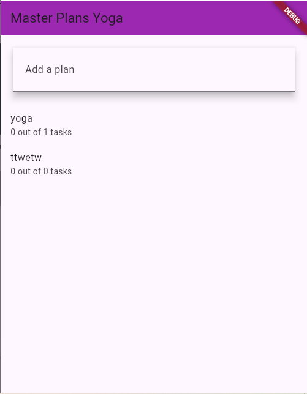
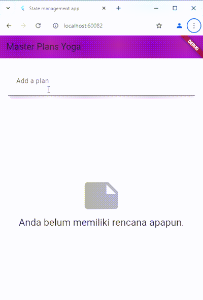

# Praktikum 1: Dasar State dengan Model-View

Langkah 1: Buat Project Baru

Buatlah sebuah project flutter baru dengan nama master_plan di folder src week-11 repository GitHub Anda. Lalu buatlah susunan folder dalam project seperti gambar berikut ini.

Langkah 2: Membuat model task.dart

Praktik terbaik untuk memulai adalah pada lapisan data (data layer). Ini akan memberi Anda gambaran yang jelas tentang aplikasi Anda, tanpa masuk ke detail antarmuka pengguna Anda. Di folder model, buat file bernama task.dart dan buat class Task. Class ini memiliki atribut description dengan tipe data String dan complete dengan tipe data Boolean, serta ada konstruktor. Kelas ini akan menyimpan data tugas untuk aplikasi kita. Tambahkan kode berikut:

Langkah 3: Buat file plan.dart

Kita juga perlu sebuah List untuk menyimpan daftar rencana dalam aplikasi to-do ini. Buat file plan.dart di dalam folder models dan isi kode seperti berikut.

Langkah 4: Buat file data_layer.dart

Kita dapat membungkus beberapa data layer ke dalam sebuah file yang nanti akan mengekspor kedua model tersebut. Dengan begitu, proses impor akan lebih ringkas seiring berkembangnya aplikasi. Buat file bernama data_layer.dart di folder models. Kodenya hanya berisi export seperti berikut.

Langkah 5: Pindah ke file main.dart

Ubah isi kode main.dart sebagai berikut.

Langkah 6: buat plan_screen.dart

Pada folder views, buatlah sebuah file plan_screen.dart dan gunakan templat StatefulWidget untuk membuat class PlanScreen. Isi kodenya adalah sebagai berikut. Gantilah teks ‘Namaku' dengan nama panggilan Anda pada title AppBar.

Langkah 7: buat method _buildAddTaskButton()

Anda akan melihat beberapa error di langkah 6, karena method yang belum dibuat. Ayo kita buat mulai dari yang paling mudah yaitu tombol Tambah Rencana. Tambah kode berikut di bawah method build di dalam class _PlanScreenState.

Langkah 8: buat widget _buildList()

Kita akan buat widget berupa List yang dapat dilakukan scroll, yaitu ListView.builder. Buat widget ListView seperti kode berikut ini.

Langkah 9: buat widget _buildTaskTile

Dari langkah 8, kita butuh ListTile untuk menampilkan setiap nilai dari plan.tasks. Kita buat dinamis untuk setiap index data, sehingga membuat view menjadi lebih mudah. Tambahkan kode berikut ini.

Langkah 10: Tambah Scroll Controller

Anda dapat menambah tugas sebanyak-banyaknya, menandainya jika sudah beres, dan melakukan scroll jika sudah semakin banyak isinya. Namun, ada salah satu fitur tertentu di iOS perlu kita tambahkan. Ketika keyboard tampil, Anda akan kesulitan untuk mengisi yang paling bawah. Untuk mengatasi itu, Anda dapat menggunakan ScrollController untuk menghapus focus dari semua TextField selama event scroll dilakukan. Pada file plan_screen.dart, tambahkan variabel scroll controller di class State tepat setelah variabel plan.

Langkah 11: Tambah Scroll Listener

Tambahkan method initState() setelah deklarasi variabel scrollController seperti kode berikut.

Langkah 12: Tambah controller dan keyboard 

Tambahkan controller dan keyboard behavior pada ListView di method _buildList seperti kode berikut ini.

Langkah 13: Terakhir, tambah method dispose()

Terakhir, tambahkan method dispose() berguna ketika widget sudah tidak digunakan lagi.

Langkah 14: Hasil

Lakukan Hot restart (bukan hot reload) pada aplikasi Flutter Anda. Anda akan melihat tampilan akhir seperti gambar berikut. Jika masih terdapat error, silakan diperbaiki hingga bisa running.

Link kode program: https://github.com/doggest25/master_plan

# Tugas Praktikum 1: Dasar State dengan Model-View

1. Selesaikan langkah-langkah praktikum tersebut, lalu dokumentasikan berupa GIF hasil akhir praktikum beserta penjelasannya di file README.md! Jika Anda menemukan ada yang error atau tidak berjalan dengan baik, silakan diperbaiki.

Jawab:done

2. Jelaskan maksud dari langkah 4 pada praktikum tersebut! Mengapa dilakukan demikian?

Jawab:

- Memudahkan Pemeliharaan: Jika proyek memiliki banyak file, ekspor ini mengurangi jumlah baris import dan membuat kode lebih mudah dipelihara.
- Meningkatkan Keterbacaan: Dengan satu titik akses, orang lain yang membaca kode Anda akan lebih mudah menemukan semua kelas atau fungsi yang diperlukan.
- Struktur Modular: Ini mengikuti praktik modular yang memecah kode ke dalam file kecil, tapi tetap mudah dikelola.

3. Mengapa perlu variabel plan di langkah 6 pada praktikum tersebut? Mengapa dibuat konstanta ?

Jawab:

- Variabel plan: Variabel plan di sini adalah sebuah instance dari kelas Plan yang akan digunakan untuk mengakses properti atau metode dari kelas tersebut dalam kode Anda.

- Menggunakan const: Penambahan const sebelum Plan() bertujuan untuk membuat objek bersifat konstan. Dengan const, objek Plan menjadi immutable (tidak bisa diubah setelah diciptakan), yang memiliki beberapa keuntungan:

- Efisiensi Memori: Objek const disimpan hanya satu kali dalam memori. Jika Plan dibuat berulang kali dengan nilai yang sama, objek ini akan menghemat memori dengan berbagi satu instance.
Pengurangan Kesalahan: Karena objek ini tidak bisa diubah, risiko perubahan tak disengaja pada data dalam Plan berkurang.
Kapan const Digunakan? const sebaiknya digunakan ketika:

- Kelas atau objeknya memang tidak memerlukan perubahan nilai selama program berjalan.
Objek tersebut hanya berfungsi sebagai data statis atau konfigurasi tetap.

4. Lakukan capture hasil dari Langkah 9 berupa GIF, kemudian jelaskan apa yang telah Anda buat!

Jawab:

5. Apa kegunaan method pada Langkah 11 dan 13 dalam lifecyle state ?

Jawab:

- initState: Inisialisasi awal ScrollController dengan listener yang menghilangkan fokus dari input field saat pengguna melakukan scroll (untuk menutup keyboard). Dipanggil saat widget pertama kali dibuat.

- dispose: Membersihkan ScrollController saat widget dihapus untuk mencegah kebocoran memori.

6. Kumpulkan laporan praktikum Anda berupa link commit atau repository GitHub ke spreadsheet yang telah disediakan!

Jawab:done

# Praktikum 2: Mengelola Data Layer dengan InheritedWidget dan InheritedNotifier

Langkah 1: Buat file plan_provider.dart

Buat folder baru provider di dalam folder lib, lalu buat file baru dengan nama plan_provider.dart berisi kode seperti berikut.

Langkah 2: Edit main.dart

Gantilah pada bagian atribut home dengan PlanProvider seperti berikut. Jangan lupa sesuaikan bagian impor jika dibutuhkan.

Langkah 3: Tambah method pada model plan.dart

Tambahkan dua method di dalam model class Plan seperti kode berikut.

Langkah 4: Pindah ke PlanScreen

Edit PlanScreen agar menggunakan data dari PlanProvider. Hapus deklarasi variabel plan (ini akan membuat error). Kita akan perbaiki pada langkah 5 berikut ini.

Langkah 5: Edit method _buildAddTaskButton

Tambahkan BuildContext sebagai parameter dan gunakan PlanProvider sebagai sumber datanya. Edit bagian kode seperti berikut.

Langkah 6: Edit method _buildTaskTile

Tambahkan parameter BuildContext, gunakan PlanProvider sebagai sumber data. Ganti TextField menjadi TextFormField untuk membuat inisial data provider menjadi lebih mudah.

Langkah 7: Edit _buildList

Sesuaikan parameter pada bagian _buildTaskTile seperti kode berikut.

Langkah 8: Tetap di class PlanScreen

Edit method build sehingga bisa tampil progress pada bagian bawah (footer). Caranya, bungkus (wrap) _buildList dengan widget Expanded dan masukkan ke dalam widget Column seperti kode pada Langkah 9.

Langkah 9: Tambah widget SafeArea

Terakhir, tambahkan widget SafeArea dengan berisi 
completenessMessage pada akhir widget Column. Perhatikan kode berikut ini.

Link kode program: https://github.com/doggest25/master_plan

# Tugas Praktikum 2: InheritedWidget

1. Selesaikan langkah-langkah praktikum tersebut, lalu dokumentasikan berupa GIF hasil akhir praktikum beserta penjelasannya di file README.md! Jika Anda menemukan ada yang error atau tidak berjalan dengan baik, silakan diperbaiki sesuai dengan tujuan aplikasi tersebut dibuat.

Jawab:done  

2. Jelaskan mana yang dimaksud InheritedWidget pada langkah 1 tersebut! Mengapa yang digunakan InheritedNotifier?

Jawab:

Mengapa Menggunakan InheritedNotifier
Dalam kode di atas, InheritedNotifier<ValueNotifier<Plan>> digunakan karena:

Data yang Diberikan Bisa Berubah: Objek ValueNotifier<Plan> memungkinkan perubahan pada data Plan yang akan memicu rebuild otomatis pada widget yang bergantung padanya.

Otomatis Mendengarkan Perubahan Data: Karena menggunakan InheritedNotifier, saat ValueNotifier<Plan> diubah, widget yang bergantung padanya (menggunakan PlanProvider.of(context)) akan secara otomatis mendeteksi perubahan dan melakukan rebuild. Ini sangat efisien dibandingkan dengan InheritedWidget biasa yang tidak memiliki mekanisme otomatis untuk mendeteksi perubahan pada data mutable.

3. Jelaskan maksud dari method di langkah 3 pada praktikum tersebut! Mengapa dilakukan demikian?

Jawab:

1. completedCount: Menghitung jumlah tugas yang selesai dengan memfilter tugas yang memiliki complete == true dan mengembalikan jumlahnya. Ini memudahkan akses informasi jumlah tugas selesai tanpa menghitung ulang.

2. completenessMessage: Menghasilkan pesan status, seperti “3 out of 5 tasks,” dengan menunjukkan jumlah tugas selesai dari total tugas. Ini mempermudah tampilan progres di UI.

Kedua getter ini membuat akses data lebih efisien dan memperbarui status secara otomatis saat tasks berubah.

4. Lakukan capture hasil dari Langkah 9 berupa GIF, kemudian jelaskan apa yang telah Anda buat!

Jawab:yang dibuat sama saja seperti praktikum 1,namun yang membedakan disini kita menggunakan inheritedWidget.

5. Kumpulkan laporan praktikum Anda berupa link commit atau repository GitHub ke spreadsheet yang telah disediakan!

Jawab:done

# Praktikum 3: Membuat State di Multiple Screens

Langkah 1: Edit PlanProvider

Perhatikan kode berikut, edit class PlanProvider sehingga dapat menangani List Plan.

Langkah 2: Edit main.dart

Langkah sebelumnya dapat menyebabkan error pada main.dart dan plan_screen.dart. Pada method build, gantilah menjadi kode seperti ini.

Langkah 3: Edit plan_screen.dart

Tambahkan variabel plan dan atribut pada constructor-nya seperti berikut.

Langkah 4: Error

Itu akan terjadi error setiap kali memanggil PlanProvider.of(context). Itu terjadi karena screen saat ini hanya menerima tugas-tugas untuk satu kelompok Plan, tapi sekarang PlanProvider menjadi list dari objek plan tersebut.

Langkah 5: Tambah getter Plan

Tambahkan getter pada _PlanScreenState seperti kode berikut.

Langkah 6: Method initState()

Pada bagian ini kode tetap seperti berikut.

Langkah 7: Widget build

Pastikan Anda telah merubah ke List dan mengubah nilai pada currentPlan seperti kode berikut ini.

Langkah 8: Edit _buildTaskTile

Pastikan ubah ke List dan variabel planNotifier seperti kode berikut ini.

Langkah 9: Buat screen baru

Pada folder view, buatlah file baru dengan nama plan_creator_screen.dart dan deklarasikan dengan StatefulWidget bernama PlanCreatorScreen. Gantilah di main.dart pada atribut home menjadi seperti berikut.

Langkah 10: Pindah ke class _PlanCreatorScreenState

Kita perlu tambahkan variabel TextEditingController sehingga bisa membuat TextField sederhana untuk menambah Plan baru. Jangan lupa tambahkan dispose ketika widget unmounted seperti kode berikut.

Langkah 11: Pindah ke method build

Letakkan method Widget build berikut di atas void dispose. Gantilah ‘Namaku' dengan nama panggilan Anda.

Langkah 12: Buat widget _buildListCreator

Buatlah widget berikut setelah widget build.

Langkah 13: Buat void addPlan()

Tambahkan method berikut untuk menerima inputan dari user berupa text plan.

Langkah 14: Buat widget _buildMasterPlans()

Tambahkan widget seperti kode berikut.

Link kode program: https://github.com/doggest25/master_plan

# Tugas Praktikum 3: State di Multiple Screens

1. Selesaikan langkah-langkah praktikum tersebut, lalu dokumentasikan berupa GIF hasil akhir praktikum beserta penjelasannya di file README.md! Jika Anda menemukan ada yang error atau tidak berjalan dengan baik, silakan diperbaiki sesuai dengan tujuan aplikasi tersebut dibuat.

Jawab:

2. Berdasarkan Praktikum 3 yang telah Anda lakukan, jelaskan maksud dari gambar diagram berikut ini!

Jawab:

jadi terdapat plan creator dan plan screen,plan creator digunakan untuk menambahkan plan baru, sedangkan plan screen digunakan untuk menampilkan plan yang telah ditambahkan oleh user.

3. Lakukan capture hasil dari Langkah 14 berupa GIF, kemudian jelaskan apa yang telah Anda buat!

Jawab: pada langkah 14 kita membuat suatu fungsi untuk menampilkan daftar rencana dan memungkinkan pengguna melihat detail lebih lanjut dengan mengetuk item.

4. Kumpulkan laporan praktikum Anda berupa link commit atau repository GitHub ke spreadsheet yang telah disediakan!

Jawab:done