# Praktikum 1: Mengunduh Data dari Web Service (API)

Langkah 1: Buat Project Baru
```
flutter pub add http
```

Langkah 2: Cek file pubspec.yaml
```
dependencies:
  flutter:
    sdk: flutter
  http: ^1.1.0
```

Langkah 3: Buka file main.dart

Soal 1

Tambahkan nama panggilan Anda pada title app sebagai identitas hasil pekerjaan Anda.
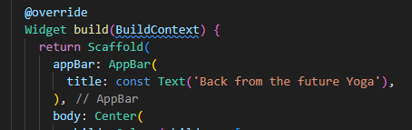
```dart
ElevatedButton(
  child: const Text('GO!'),
  onPressed: () {
    print('Button pressed');
    setState(() {});
    print('State set');
    getData().then((value) {
      print('Data received');
      result = value.body.toString().substring(0, 450);
      setState(() {});
      print('State set with result');
    }).catchError((_) {
      print('Error occurred');
      result = 'An error occurred';
      setState(() {});
      print('State set with error');
    });
  },
),
```


```dart
import 'dart:async';
import 'package:flutter/material.dart';
import 'package:http/http.dart';
import 'package:http/http.dart' as http;

void main() {
  runApp(const MyApp());
}

class MyApp extends StatelessWidget {
  const MyApp({super.key});

  @override
  Widget build(BuildContext context) {
    return MaterialApp(
      title: 'Future Demo Yoga',
      theme: ThemeData(
        primarySwatch: Colors.blue,
        visualDensity: VisualDensity.adaptivePlatformDensity,
      ),
      home: const FuturePage(),
    );
  }
}

class FuturePage extends StatefulWidget {
  const FuturePage({super.key});

  @override
  State<FuturePage> createState() => _FuturePageState();
}

class _FuturePageState extends State<FuturePage> {
  String result = '';

  @override
  Widget build(BuildContext) {
    return Scaffold(
      appBar: AppBar(
        title: const Text('Back from the future Yoga'),
      ),
      body: Center(
        child: Column(children: [
          const Spacer(),
          ElevatedButton(
            child: const Text('GO!'),
            onPressed: () {
             
            },
          ),
          const Spacer(),
          Text(result),
          const Spacer(),
          const CircularProgressIndicator(),
          const Spacer(),
        ]),
      ),
    );
  }
}
```

Langkah 4: Tambah method getData()
```dart
Future<Response> getData() async {
    const authority = 'www.googleapis.com';
    const path = '/books/v1/volumes/junbDwAAQBAJ';
    Uri url = Uri.https(authority, path);

    return http.get(url);
  }
```
Soal 2

- Carilah judul buku favorit Anda di Google Books, lalu ganti ID buku pada variabel path di kode tersebut. Caranya ambil di URL browser Anda seperti gambar berikut ini.

- Kemudian cobalah akses di browser URI tersebut dengan lengkap seperti ini. Jika menampilkan data JSON, maka Anda telah berhasil. Lakukan capture milik Anda dan tulis di README pada laporan praktikum. Lalu lakukan commit dengan pesan "W11: Soal 2".

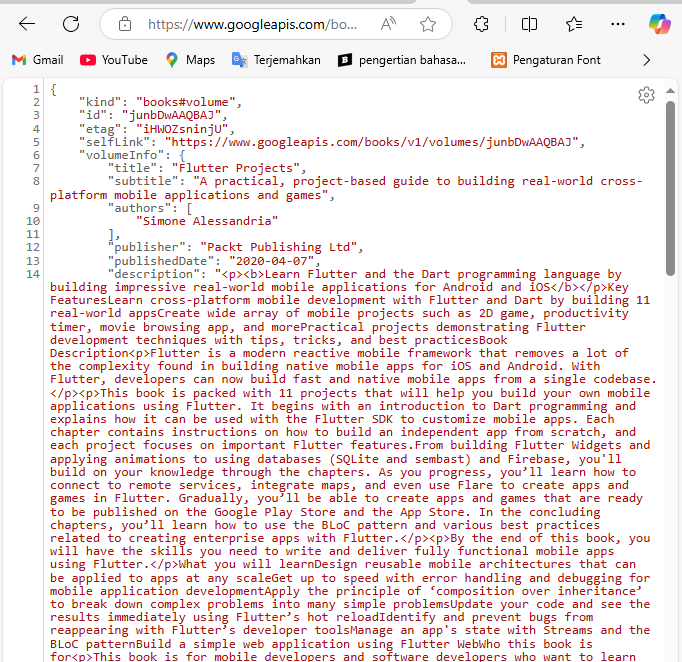

Langkah 5: Tambah kode di ElevatedButton

```dart
ElevatedButton(
            child: const Text('GO!'),
            onPressed: () {
              setState(() {});
              getData().then((value) {
                result = value.body.toString().substring(0, 450);
                setState(() {});
              }).catchError((_) {
                result = 'An error occurred';
                setState(() {});
              });
            },
          ),
```

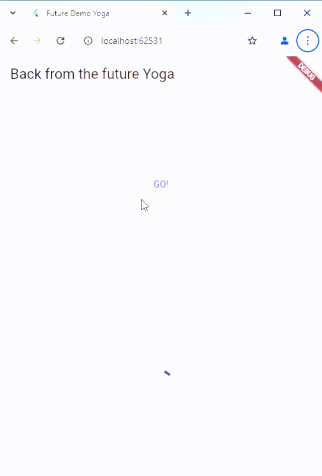

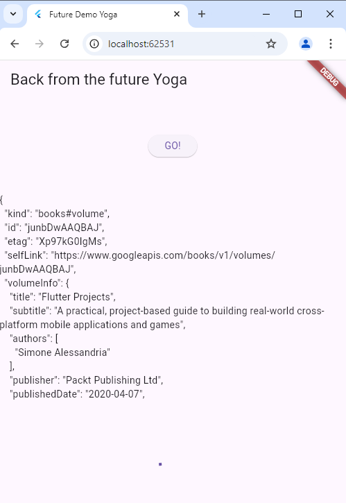

Link  kode program: https://github.com/doggest25/books


# Praktikum 2: Menggunakan await/async untuk menghindari callbacks

Langkah 1: Buka file main.dart
```dart
Future<int> returnOneAsync() async {
  await Future.delayed(const Duration(seconds: 3));
  return 1;
}

Future<int> returnTwoAsync() async {
  await Future.delayed(const Duration(seconds: 3));
  return 2;
}

Future<int> returnThreeAsync() async {
  await Future.delayed(const Duration(seconds: 3));
  return 3;
}
```
Langkah 2: Tambah method count()
```dart

Future count() async {
    int total = 0;
    total = await returnOneAsync();
    total += await returnTwoAsync();
    total += await returnThreeAsync();
    setState(() {
      result = total.toString();
    });
  }
```

Langkah 3: Panggil count()
```dart
ElevatedButton(
            child: const Text('GO!'),
            onPressed: () {
              
              count();
            },
          ),
```

Langkah 4: Run 

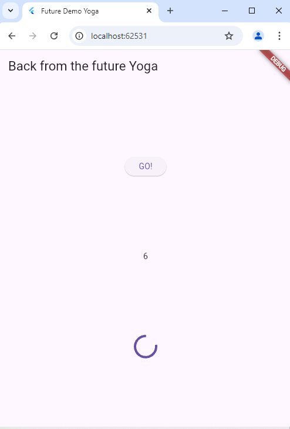

Soal 4

- Jelaskan maksud kode langkah 1 dan 2 tersebut!

Kode ini bertujuan menghitung total dari tiga fungsi asinkron (returnOneAsync, returnTwoAsync, dan returnThreeAsync) yang masing-masing mengembalikan nilai setelah menunggu 3 detik. Hasilnya ditampilkan di antarmuka pengguna.

Cara Kerja Kode:
1. Setiap fungsi (returnOneAsync, returnTwoAsync, returnThreeAsync) menunggu 3 detik lalu mengembalikan nilai (masing-masing 1, 2, dan 3).
2. Fungsi count() memanggil ketiga fungsi tersebut secara berurutan dengan await, menghitung totalnya (1 + 2 + 3 = 6).
3. Setelah ketiga fungsi selesai, setState memperbarui result dengan nilai total ("6") agar tampil di UI.

Total waktu tunggu adalah 9 detik karena fungsi dijalankan satu per satu.

- Capture hasil praktikum Anda berupa GIF dan lampirkan di README. Lalu lakukan commit dengan pesan "W11: Soal 4".

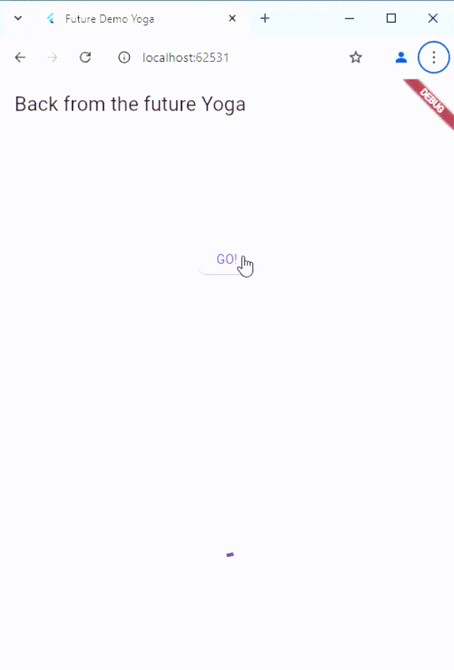

Link  kode program: https://github.com/doggest25/books

# Praktikum 3: Menggunakan Completer di Future

Langkah 1: Buka main.dart
```dart
import 'package:async/async.dart';
```
Langkah 2: Tambahkan variabel dan method
```dart
late Completer completer;

Future getNumber() {
  completer = Completer<int>();
  calculate();
  return completer.future;
}

Future calculate() async {
  await Future.delayed(const Duration(seconds : 5));
  completer.complete(42);
}
```

Langkah 3: Ganti isi kode onPressed()
```dart
getNumber().then((value) {
                setState(() {
                  result = value.toString();
                });
              });
```

Langkah 4:

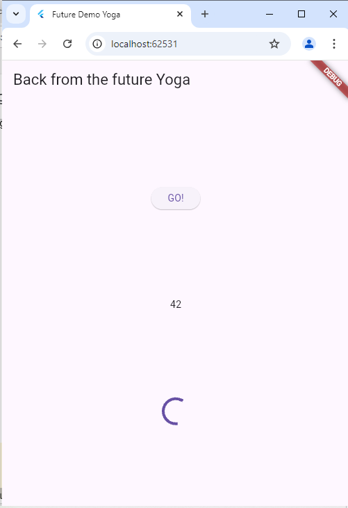

Soal 5

- Jelaskan maksud kode langkah 2 tersebut!

ode ini menggunakan Completer untuk menyelesaikan Future secara manual setelah beberapa waktu.

Penjelasan Ringkas:
1. completer = Completer<int>(); membuat sebuah Completer yang dapat mengendalikan penyelesaian Future<int>.
2. getNumber() menginisialisasi completer, memanggil calculate(), dan mengembalikan completer.future, yaitu Future yang akan diselesaikan nanti.
3. calculate() adalah fungsi asinkron yang menunggu 5 detik dengan Future.delayed.
4. Setelah menunggu, calculate() menyelesaikan completer dengan nilai 42 menggunakan completer.complete(42);.

Hasilnya: Ketika getNumber() dipanggil, fungsi akan mengembalikan Future yang akan selesai setelah 5 detik, dengan nilai 42.


- Capture hasil praktikum Anda berupa GIF dan lampirkan di README. Lalu lakukan commit dengan pesan "W11: Soal 5".

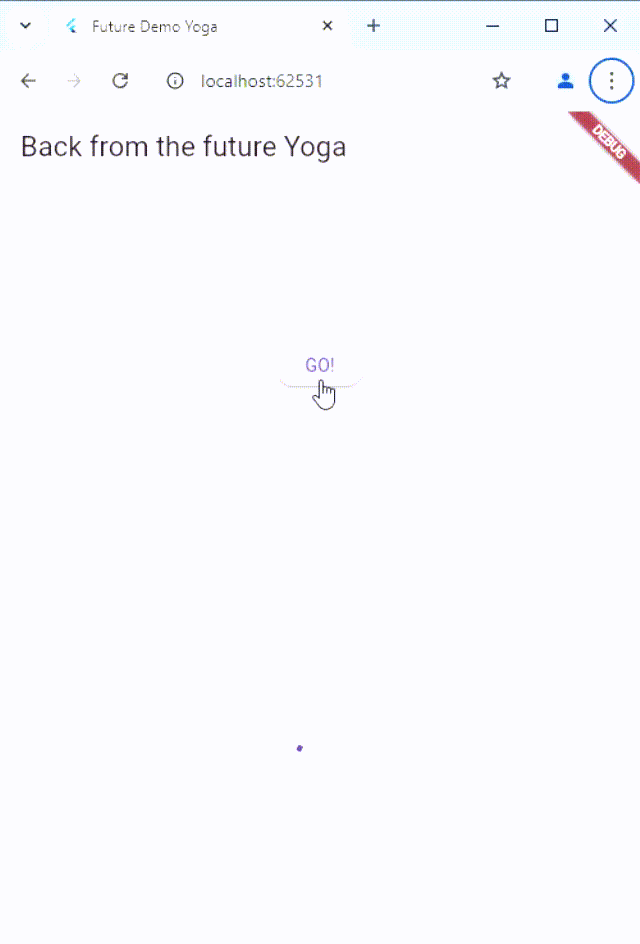

Langkah 5: Ganti method calculate()
```dart
Future calculate() async {
    try {
      await new Future.delayed(const Duration(seconds: 5));
      completer.complete(42);
    } catch (_) {
      completer.completeError({});
    }
  }
```

Langkah 6: Pindah ke onPressed()
```dart
getNumber().then((value) {
                setState(() {
                  result = value.toString();
                });
              }).catchError((e) {
                result = 'An error occurred';
              });
```

Soal 6

- Jelaskan maksud perbedaan kode langkah 2 dengan langkah 5-6 tersebut!

Kode Awal: calculate() hanya menyelesaikan Future dengan nilai 42 tanpa penanganan kesalahan. Jika terjadi kesalahan, itu tidak tertangani, dan completer.future tidak akan pernah diselesaikan (bisa menyebabkan aplikasi "tergantung").

Kode Baru: calculate() memiliki blok try-catch, yang berarti jika ada kesalahan, completer.completeError({}); akan dipanggil untuk menyelesaikan Future dengan status error. Ini memungkinkan penanganan error lebih baik, karena error akan dikirim ke catchError pada onPressed().

- Capture hasil praktikum Anda berupa GIF dan lampirkan di README. Lalu lakukan commit dengan pesan "W11: Soal 6".


Link  kode program: https://github.com/doggest25/books

# Praktikum 4: Memanggil Future secara paralel

Langkah 1: Buka file main.dart
```dart
void returnFG() {
    FutureGroup<int> futureGroup = FutureGroup<int>();
    futureGroup.add(returnOneAsync());
    futureGroup.add(returnTwoAsync());
    futureGroup.add(returnThreeAsync());
    futureGroup.close();
    futureGroup.future.then((List<int> value) {
      int total = 0;
      for (var element in value) {
        total += element;
      }
      setState(() {
        result = total.toString();
      });
    });
  }
  ```

Langkah 2: Edit onPressed()
```dart
returnFG();
```

Langkah 3: Run

Soal 7

- Capture hasil praktikum Anda berupa GIF dan lampirkan di README. Lalu lakukan commit dengan pesan "W11: Soal 7".


Langkah 4: Ganti variabel futureGroup
```dart
final futures = Future.wait<int>([
  returnOneAsync(),
  returnTwoAsync(),
  returnThreeAsync(),
]);
```

Soal 8

- Jelaskan maksud perbedaan kode langkah 1 dan 4!

1. Langkah 1 (FutureGroup): Menggunakan FutureGroup untuk menambahkan beberapa Future (dalam hal ini returnOneAsync(), returnTwoAsync(), dan returnThreeAsync()). FutureGroup memungkinkan kita untuk menambahkan futures secara bertahap dan kemudian menutupnya dengan close(), baru kemudian menunggu hasil dari semua futures yang telah ditambahkan.

2. Langkah 4 (Future.wait): Langsung menggunakan Future.wait, yang mengeksekusi dan menunggu semua Future yang diberikan dalam satu daftar (array) secara bersamaan. Pendekatan ini lebih sederhana jika semua futures sudah diketahui sejak awal.

Link  kode program: https://github.com/doggest25/books

# Praktikum 5: Menangani Respon Error pada Async Code

Langkah 1: Buka file main.dart
```dart
Future returnError() async {
    await Future.delayed(const Duration(seconds: 2))
    throw Exception('Something terrible happennd!');
  }
```

Langkah 2: ElevatedButton
```dart
returnError()
                  .then((value){
                    setState((){
                      result = 'Success';
                    });
                  }).catchError((onError){
                    setState(() {
                      result = onError.toString();
                    });
                  }).whenComplete(() => print('Complete'));
```

Langkah 3: Run

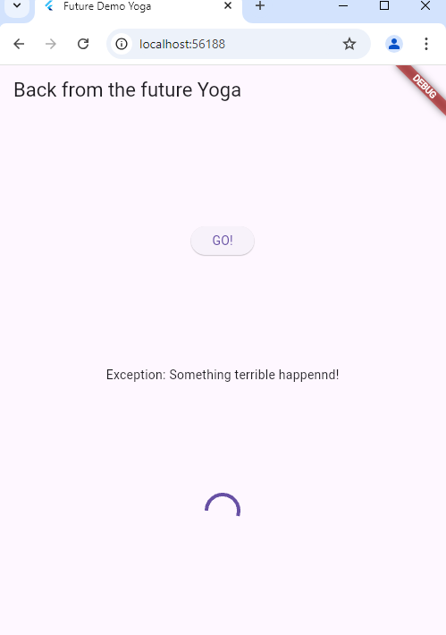

Soal 9

- Capture hasil praktikum Anda berupa GIF dan lampirkan di README. Lalu lakukan commit dengan pesan "W11: Soal 9".

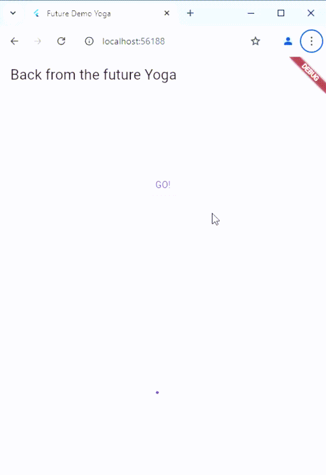

Langkah 4: Tambah method handleError()
```dart
Future handleError() async {
    try {
      await returnError();
    } catch (error) {
      setState(() {
        result = error.toString();
      });
    } finally {
      print('Complete');
    }
  }
```

Soal 10

- Panggil method handleError() tersebut di ElevatedButton, lalu run. Apa hasilnya? Jelaskan perbedaan kode langkah 1 dan 4!

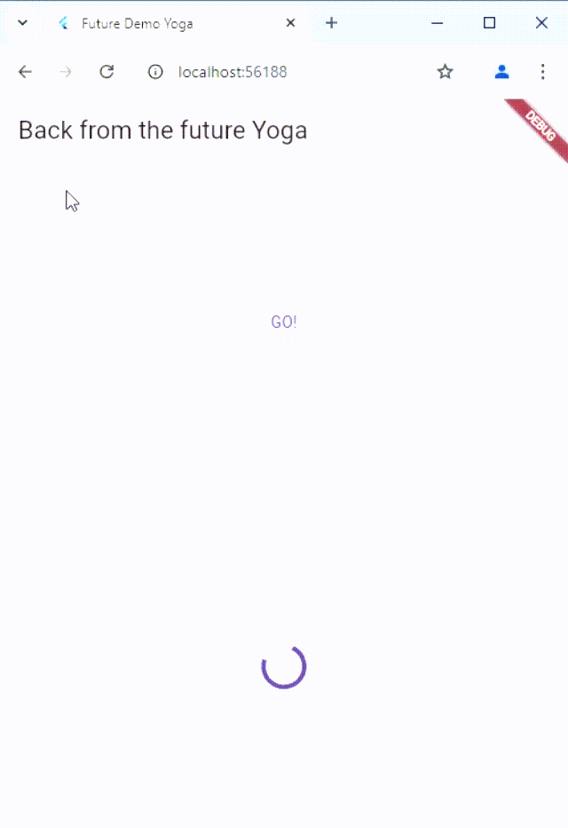

1. Langkah 1 (Membuat fungsi returnError):
- Membuat sebuah fungsi Future yang akan selalu menghasilkan error setelah jeda 2 detik.
- Tidak ada mekanisme penanganan error di fungsi ini.

2. Langkah 4 (Menambahkan fungsi handleError):
- Membuat fungsi baru untuk memanggil returnError dengan mekanisme error handling menggunakan blok try-catch.
- Jika terjadi error, pesan error akan ditangani dan diperbarui dalam variabel result melalui setState.
- Blok finally memastikan kode tertentu tetap dijalankan, seperti mencetak pesan "Complete."

Jadi, Langkah 1 hanya mendefinisikan error, sedangkan Langkah 4 menangani error tersebut dengan aman.

Link  kode program: https://github.com/doggest25/books

# Praktikum 6: Menggunakan Future dengan StatefulWidget

Langkah 1: install plugin geolocator
```dart
flutter pub add geolocator
```

Langkah 2: Tambah permission GPS
```dart
<uses-permission android:name="android.permission.ACCESS_FINE_LOCATION"/>
<uses-permission android:name="android.permission.ACCESS_COARSE_LOCATION"/>
```

Langkah 3: Buat file geolocation.dart

Buat class LocationScreen di dalam file geolocation.dart

Langkah 4: Buat StatefulWidget

Buat class LocationScreen di dalam file geolocation.dart

Langkah 5: Isi kode geolocation.dart
```dart
import 'package:flutter/material.dart';
import 'package:geolocator/geolocator.dart';

class LocationScreen extends StatefulWidget {
  const LocationScreen({super.key});

  @override
  State<LocationScreen> createState() => _LocationScreenState();
}

class _LocationScreenState extends State<LocationScreen> {
  String myPosition = '';
  @override
  void initState() {
    super.initState();
    getPosition().then((Position myPos) {
      myPosition =
          'Latitude: ${myPos.latitude.toString()} - Longitude: ${myPos.longitude.toString()}';
      setState(() {
        myPosition = myPosition;
      });
    });
  }

  @override
  Widget build(BuildContext context) {
    return Scaffold(
      appBar: AppBar(title: const Text('Current Location Yoga')),
      body: Center(child: Text(myPosition)),
    );
  }

  Future<Position> getPosition() async {
    await Geolocator.requestPermission();
    await Geolocator.isLocationServiceEnabled();
    Position? position = await Geolocator.getCurrentPosition();
    
    return position;
  }
}

```

Soal 11

- Tambahkan nama panggilan Anda pada tiap properti title sebagai identitas pekerjaan Anda.
 
done

Langkah 6: Edit main.dart
```dart
home: LocationScreen(),
```

Langkah 7: Run

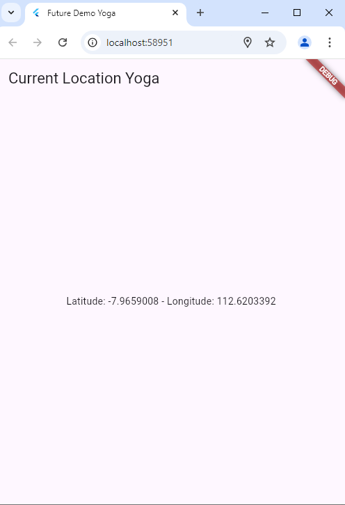

Langkah 8: Tambahkan animasi loading
```dart
Widget build(BuildContext context) {
    final MyWidget = myPosition == ''
        ? const CircularProgressIndicator()
        : Text(myPosition);
    
    return Scaffold(
      appBar: AppBar(title: Text('Current Location Yoga')),
      body: Center(child: MyWidget),
    );
  }
```
Soal 12

- Jika Anda tidak melihat animasi loading tampil, kemungkinan itu berjalan sangat cepat. Tambahkan delay pada method getPosition() dengan kode await Future.delayed(const Duration(seconds: 3));
```dart
 Future<Position> getPosition() async {
  await Future.delayed(const Duration(seconds: 3)); // Menambahkan delay selama 3 detik
  await Geolocator.requestPermission();
  await Geolocator.isLocationServiceEnabled();
  Position position = await Geolocator.getCurrentPosition();

  return position;
 }
```
- Apakah Anda mendapatkan koordinat GPS ketika run di browser? Mengapa demikian?

Izin Lokasi di Browser

Browser memerlukan izin pengguna untuk mengakses lokasi. Jika izin ini tidak diberikan, maka geolocator tidak dapat mengambil data.
Jika fitur "lokasi" di browser dinonaktifkan, aplikasi tidak akan bisa mendapatkan koordinat sama sekali.

- Capture hasil praktikum Anda berupa GIF dan lampirkan di README. Lalu lakukan commit dengan pesan "W11: Soal 12".


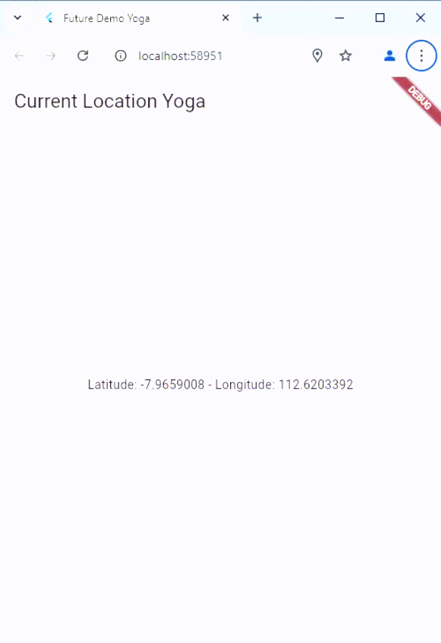

Link  kode program: https://github.com/doggest25/books

# Praktikum 7: Manajemen Future dengan FutureBuilder

Langkah 1: Modifikasi method getPosition()
```dart
Future<Position> getPosition() async {
    await Geolocator.isLocationServiceEnabled();
    await Future.delayed(const Duration(seconds: 3));
    Position position = await Geolocator.getCurrentPosition();

    return position;
  }
```

Langkah 2: Tambah variabel
```dart
Future<Position>? position;
```

Langkah 3: Tambah initState()
```dart
@override
  void initState() {
    super.initState();
    position = getPosition();
  }
```
Langkah 4: Edit method build()
```dart
@override
  Widget build(BuildContext context) {
    return Scaffold(
        appBar: AppBar(title: Text('Current Location Yoga')),
        body: Center(
          child: FutureBuilder(
            future: position,
            builder: (BuildContext context, AsyncSnapshot<Position> snapshot) {
              if (snapshot.connectionState == ConnectionState.waiting) {
                return const CircularProgressIndicator();
              } else if (snapshot.connectionState == ConnectionState.done) {
                return Text(snapshot.data.toString());
              } else {
                return const Text('');
              }
            },
            ),
        ));
  }
```

Soal 13

- Apakah ada perbedaan UI dengan praktikum sebelumnya? Mengapa demikian?

Pendekatan Asynchronous:

1. - Kode Sebelumnya: UI diperbarui secara manual dengan setState() setelah mendapatkan posisi melalui metode initState() dan getPosition().
    Loading indicator hanya terlihat jika data lokasi belum selesai diambil.
   - Kode Sekarang: Menggunakan FutureBuilder untuk menangani data asinkron. Komponen ini secara otomatis mengelola tampilan UI berdasarkan status koneksi (waiting, done, dll.).
    Kontrol Tampilan:

2. - Kode Sebelumnya: Bergantung pada variabel lokal myPosition untuk menentukan apakah animasi loading atau teks lokasi yang akan ditampilkan.
   - Kode Sekarang: UI lebih dinamis karena FutureBuilder mengubah tampilan sesuai dengan status snapshot (contoh: waiting, done, atau error).
     Responsivitas Error:

3. - Kode Sebelumnya: Tidak menangani kemungkinan error dengan baik (misalnya, pengguna menolak izin lokasi).
   - Kode Sekarang: Memeriksa error di dalam FutureBuilder dan memberikan tampilan error ("Something terrible happened!").

Mengapa demikian

    - Kode Sebelumnya: Menggunakan setState() secara manual untuk memperbarui tampilan setelah data lokasi diperoleh.
    
    - Kode Sekarang: Menggunakan FutureBuilder, yang secara otomatis mengelola status asinkron dan memperbarui UI berdasarkan status tersebut, menjadikannya lebih fleksibel dan tangguh untuk error handling.

- Capture hasil praktikum Anda berupa GIF dan lampirkan di README. Lalu lakukan commit dengan pesan "W11: Soal 13". 

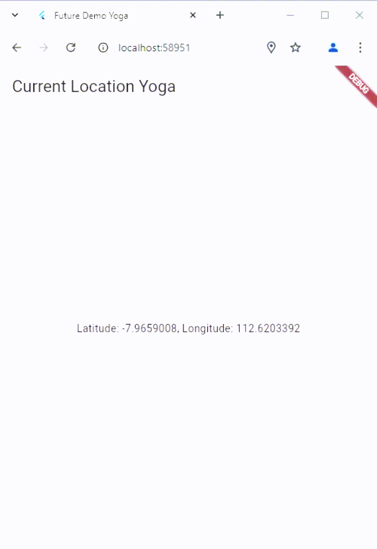

- Seperti yang Anda lihat, menggunakan FutureBuilder lebih efisien, clean, dan reactive dengan Future bersama UI.


Langkah 5: Tambah handling error
```dart
else if (snapshot.connectionState == ConnectionState.done) {
  if (snapshot.hasError) {
     return Text('Something terrible happened!');
  }
  return Text(snapshot.data.toString());
}
```

Soal 14

- Apakah ada perbedaan UI dengan langkah sebelumnya? Mengapa demikian?

  - Langkah Sebelumnya: Jika error terjadi, UI mungkin tetap mencoba menampilkan data yang kosong atau null, sehingga hasilnya terlihat seperti bug.

  - Langkah Sekarang: UI lebih informatif karena menampilkan pesan error seperti "Something terrible happened!" ketika ada masalah, sehingga pengguna menyadari bahwa ada kendala.

- Capture hasil praktikum Anda berupa GIF dan lampirkan di README. Lalu lakukan commit dengan pesan "W11: Soal 14".


Link  kode program: https://github.com/doggest25/books

# Praktikum 8: Navigation route dengan Future Function

Langkah 1: Buat file baru navigation_first.dart

Buatlah file baru ini di project lib Anda.  

Langkah 2: Isi kode navigation_first.dart
```dart
mport 'package:books/navigation_second.dart';
import 'package:flutter/material.dart';

class NavigationFirst extends StatefulWidget {
  const NavigationFirst({super.key});

  @override
  State<NavigationFirst> createState() => _NavigationFirstState();
}

class _NavigationFirstState extends State<NavigationFirst> {
  Color color = Colors.blue.shade700;
  @override
  Widget build(BuildContext context) {
    return Scaffold(
      backgroundColor: color,
      appBar: AppBar(
        title: const Text('Navigation First Screen Yoga'),
      ),
      body: Center(
        child: ElevatedButton( 
          child: const Text('Change Color'),
          onPressed: () {
            _navigateAndGetColor(context);
          }),
      ),
    );
  }
}
```

Soal 15

- Tambahkan nama panggilan Anda pada tiap properti title sebagai identitas pekerjaan Anda.

done

- Silakan ganti dengan warna tema favorit Anda.

done

Langkah 3: Tambah method di class _NavigationFirstState
```dart
Future _navigateAndGetColor(BuildContext context) async {
    color = await Navigator.push(
          context,
          MaterialPageRoute(builder: (context) => const NavigationSecond()),
        ) ??
        Colors.blue;
    setState(() {});
  }
```
Langkah 4: Buat file baru navigation_second.dart

Langkah 5: Buat class NavigationSecond dengan StatefulWidget
```dart
import 'package:flutter/material.dart';

class NavigationSecond extends StatefulWidget {
  const NavigationSecond({super.key});

  @override
  State<NavigationSecond> createState() => _NavigationSecondState();
}

class _NavigationSecondState extends State<NavigationSecond> {
  @override
  Widget build(BuildContext context) {
    Color color;
    return Scaffold(
      appBar: AppBar(
        title: const Text('Navigation Second Screen'),
      ),
      body: Center(
        child:
            Column(mainAxisAlignment: MainAxisAlignment.spaceEvenly, children: [
          ElevatedButton(
              child: const Text('Red'),
              onPressed: () {
                color = Colors.red.shade700;
                Navigator.pop(context, color);
              }),
          ElevatedButton(
              child: const Text('Green'),
              onPressed: () {
                color = Colors.green.shade700;
                Navigator.pop(context, color);
              }),
          ElevatedButton(
              child: const Text('Blue'),
              onPressed: () {
                color = Colors.blue.shade700;
                Navigator.pop(context, color);
              }),
        ]),
      ),
    );
  }
}

```
Langkah 6: Edit main.dart
```dart
home: const NavigationFirst(),
```

Langkah 8: Run

Lakukan run, jika terjadi error silakan diperbaiki.

Soal 16

- Cobalah klik setiap button, apa yang terjadi ? Mengapa demikian ?

  - Klik Tombol "Red", "Green", atau "Blue": Warna latar belakang layar pertama berubah sesuai tombol yang diklik.
  - Kembali Tanpa Memilih Tombol: Warna latar belakang layar pertama tetap biru sebagai default.
Ini terjadi karena data dikirim kembali dari layar kedua ke layar pertama menggunakan Navigator.pop(context, data), dan layar pertama diperbarui dengan warna yang diterima.

- Gantilah 3 warna pada langkah 5 dengan warna favorit Anda!

done ini warna favorite saya

- Capture hasil praktikum Anda berupa GIF dan lampirkan di README. Lalu lakukan commit dengan pesan "W11: Soal 16".

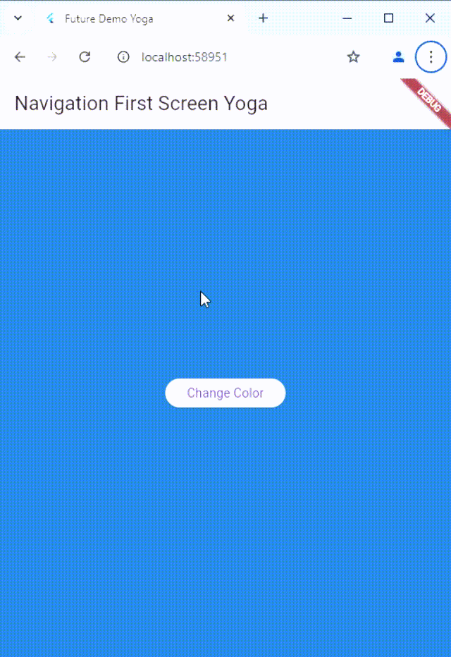

Link  kode program: https://github.com/doggest25/books

# Praktikum 9: Memanfaatkan async/await dengan Widget Dialog

Langkah 1: Buat file baru navigation_dialog.dart

Buat file dart baru di folder lib project Anda.

Langkah 2: Isi kode navigation_dialog.dart
```dart
import 'package:flutter/material.dart';

class NavigationDialogScreen extends StatefulWidget {
  const NavigationDialogScreen({super.key});

  @override
  State<NavigationDialogScreen> createState() => _NavigationDialogScreenState();
}

class _NavigationDialogScreenState extends State<NavigationDialogScreen> {
  Color color = Colors.blue.shade700;

  @override
  Widget build(BuildContext context) {
    return Scaffold(
        backgroundColor: color,
        appBar: AppBar(
          title: const Text('Navigation Dialog Screen Yoga'),
        ),
        body: Center(
          child: ElevatedButton(
              child: const Text('Change Color'), 
              onPressed: () {
                
              }),
        ));
  }
```

Langkah 3: Tambah method async
```dart
Future _showColorDialog(BuildContext context) async {
    await showDialog(
      barrierDismissible: false,
      context: context,
      builder: (_) {
        return AlertDialog(
          title: const Text('Very Important Question'),
          content: const Text('Please choose a color'),
          actions: <Widget>[
            TextButton(
              child: const Text('Red'),
              onPressed: () {
                color = Colors.red.shade700;
                Navigator.pop(context, color);
              },
            ),
            TextButton(
              child: const Text('Green'),
              onPressed: () {
                color = Colors.green.shade700;
                Navigator.pop(context, color);
              },
            ),
            TextButton(
              child: const Text('Blue'),
              onPressed: () {
                color = Colors.blue.shade700;
                Navigator.pop(context, color);
              },
            ),
          ],
        );
      },
    );
    setState(() {}); // Memperbarui UI setelah memilih warna
  }

```
Langkah 4: Panggil method di ElevatedButton
```dart
onPressed: () {
                _showColorDialog(context);
              }),
}
```
Langkah 5: Edit main.dart
```dart
home: const NavigationDialogScreen(),
```

Langkah 6: Run

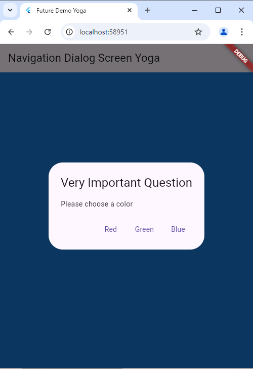

Soal 17
- Cobalah klik setiap button, apa yang terjadi ? Mengapa demikian ?

  - Ketika tombol ditekan, warna dipilih, dialog ditutup, dan warna latar belakang layar berubah.
Ini terjadi karena:
  - showDialog digunakan untuk menampilkan dialog.
  - Navigator.pop mengembalikan data warna yang dipilih.
  - setState memastikan UI diperbarui dengan warna yang baru.

- Gantilah 3 warna pada langkah 3 dengan warna favorit Anda!

done

- Capture hasil praktikum Anda berupa GIF dan lampirkan di README. Lalu lakukan commit dengan pesan "W11: Soal 17".

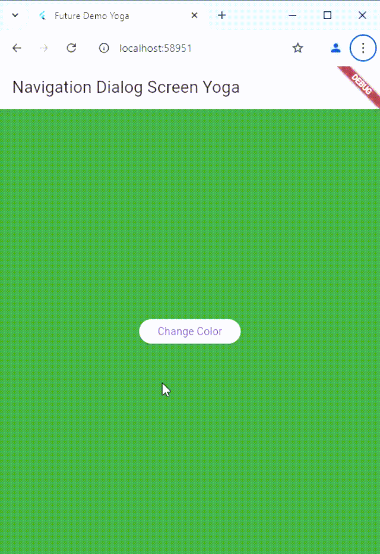

Link  kode program: https://github.com/doggest25/books