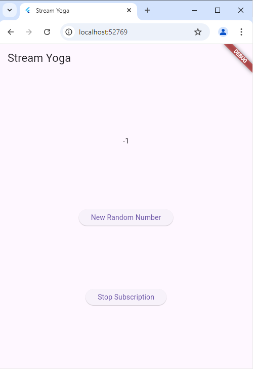

# Praktikum 1: Dart Streams

Langkah 1: Buat Project Baru

Buatlah sebuah project flutter baru dengan nama stream_nama (beri nama panggilan Anda) di folder week-13/src/ repository GitHub Anda.

Langkah 2: Buka file main.dart
```dart
import 'package:flutter/material.dart';

void main() {
  runApp(const MyApp());
}

class MyApp extends StatelessWidget {
  const MyApp({super.key});

  @override
  Widget build(BuildContext context) {
    return MaterialApp(
      title: 'Stream',
      theme: ThemeData(
        primarySwatch: Colors.deepPurple,
      ),
      home: const StreamHomePage(),
    );
  }
}

class StreamHomePage extends StatefulWidget {
  const StreamHomePage({super.key});

  @override
  State<StreamHomePage> createState() => _StreamHomePageState();
}

class _StreamHomePageState extends State<StreamHomePage> {
  @override
  Widget build(BuildContext) {
    return Container();
  }
}

```

Soal 1
- Tambahkan nama panggilan Anda pada title app sebagai identitas hasil pekerjaan Anda.


- Gantilah warna tema aplikasi sesuai kesukaan Anda.


- Lakukan commit hasil jawaban Soal 1 dengan pesan "W13: Jawaban Soal 1"

Langkah 3: Buat file baru stream.dart
```dart
import 'package:flutter/material.dart';

class ColorStream {

  
}
```

Langkah 4: Tambah variabel colors
```dart
  final List<Color> colors = 
    Colors.blueGrey,
    Colors.amber,
    Colors.deepPurple,
    Colors.lightBlue,
    Colors.teal,
  
```

Soal 2
- Tambahkan 5 warna lainnya sesuai keinginan Anda pada variabel colors tersebut.


- Lakukan commit hasil jawaban Soal 2 dengan pesan "W13: Jawaban Soal 2"

Langkah 5: Tambah method getColors()
```dart
Stream<Color> getColors() async* {
    
  }
```
Langkah 6: Tambah perintah yield*
```dart
yield* Stream.periodic(
  const Duration(seconds: 1), (int t) {
    int index = t % colors.length;
    return colors[index];
});
```

Soal 3

- Jelaskan fungsi keyword yield* pada kode tersebut!

`Fungsi yield*:`
`Menggabungkan atau meneruskan elemen/stream lain ke dalam stream saat ini.Mempermudah menyalurkan elemen dari stream lain tanpa harus mengiterasi dan menggunakan yield satu per satu.`

- Apa maksud isi perintah kode tersebut?

`yield*:`
    `Digunakan untuk "meneruskan" semua elemen dari stream yang dihasilkan oleh Stream.periodic langsung ke stream utama (getColors).Dengan kata lain, semua data yang dihasilkan oleh Stream.periodic akan dikirimkan ke stream output dari getColors.`

- Lakukan commit hasil jawaban Soal 3 dengan pesan "W13: Jawaban Soal 3"

Langkah 7: Buka main.dart
```dart
import 'stream.dart';
```

Langkah 8: Tambah variabel
```dart
 Color bgColor = Colors.blueGrey;
  late ColorStream colorStream;
```

Langkah 9: Tambah method changeColor()
```dart
void changeColor() async {
    await for (var eventColor in ColorStream.getColors()) {
      setState(() {
        bgColor = eventColor;
      });
    }
  }
```

Langkah 10: Lakukan override initState()
```dart
@override
  void initState() {
    super.initState();
    colorStream = ColorStream();
    changeColor();
  }
```

Langkah 11: Ubah isi Scaffold()

Langkah 12: Run

Soal 4
- Capture hasil praktikum Anda berupa GIF dan lampirkan di README.


- Lakukan commit hasil jawaban Soal 4 dengan pesan "W13: Jawaban Soal 4"

Langkah 13: Ganti isi method changeColor()
```dart
colorStream.getColors().listen((eventColor) {
      setState(() {
        bgColor = eventColor;
      });
    });
```
Soal 5
- Jelaskan perbedaan menggunakan listen dan await for (langkah 9) !

## Perbedaan `await for` dan `listen`

| **Aspek**                  | **`await for`**                              | **`listen`**                              |
|----------------------------|----------------------------------------------|-------------------------------------------|
| **Sifat Konsumsi**         | Sinkron dalam konteks fungsi asinkron        | Asinkron sepenuhnya                       |
| **Kesesuaian untuk Stream**| Stream finite                                | Stream infinite                           |
| **Blokir Eksekusi**        | Ya, menunggu hingga semua elemen selesai     | Tidak, proses lain dapat tetap berjalan   |
| **Penggunaan di Fungsi**   | Memerlukan `async`                           | Tidak memerlukan `async`                  |
| **Penghentian**            | Berhenti setelah semua elemen diproses       | Harus secara eksplisit menghentikan jika diperlukan |

- Lakukan commit hasil jawaban Soal 5 dengan pesan "W13: Jawaban Soal 5"

Link kode program:https://github.com/doggest25/steam_yoga

# Praktikum 2: Stream controllers dan sinks

Langkah 1: Buka file stream.dart
```dart
import 'dart:async';
```dart
final StreamController<int> controller = StreamController<int>();
```

Langkah 2: Tambah class NumberStream
```dart
void addNumberToSink(int newNumber) {
    controller.sink.add(newNumber);
  }
```

Langkah 3: Tambah StreamController
```dart
final StreamController<int> controller = StreamController<int>();
```
Langkah 4: Tambah method addNumberToSink
```dart
 void addNumberToSink(int newNumber) {
    controller.sink.add(newNumber);
  }
```
Langkah 5: Tambah method close()
```dart
close() {
    controller.close();
  }
```

Langkah 6: Buka main.dart
```dart
import 'dart:async';
import 'dart:math';
```

Langkah 7: Tambah variabel  
```dart
int lastNumber = 0;
  late StreamController numberStreamController;
  late NumberStream numberStream;
```

Langkah 8: Edit initState()
```dart
@override
  void initState() {
    numberStream = NumberStream();
    numberStreamController = numberStream.controller;
    Stream stream = numberStreamController.stream;
    stream.listen((event) {
      setState(() {
        lastNumber = event;
      });
    });
    super.initState();
  }
```

Langkah 9: Edit dispose()
```dart
@override
  void dispose() {
    numberStreamController.close();
    super.dispose();
  }
```

Langkah 10: Tambah method addRandomNumber()
```dart
void addRandomNumber() {
  Random random = Random();
  int myNum = random.nextInt(10);
  numberStream.addNumberToSink(myNum);
}
```

Langkah 11: Edit method build()
```dart
body: SizedBox(
                width: double.infinity,
                child: Column(
                  mainAxisAlignment: MainAxisAlignment.spaceEvenly,
                  crossAxisAlignment: CrossAxisAlignment.center,
                  children: [
                    Text(lastNumber.toString()),
                    ElevatedButton(
                      onPressed: () => addRandomNumber(),
                      child: Text('New Random Number'),
                    )
                    ],
                  
                ),
      ),
```

Langkah 12: Run


Soal 6
- Jelaskan maksud kode langkah 8 dan 10 tersebut!

1. Inisialisasi (initState):

    Membuat stream dan mendengarkan angka yang dipancarkan.
    Ketika angka baru dipancarkan, variabel lastNumber diperbarui.

2. Menambahkan Angka Baru (addRandomNumber):

    Angka acak dibuat dan ditambahkan ke stream.
    Listener pada stream menerima angka baru dan memperbarui UI dengan angka tersebut.

Kesimpulan

Kedua kode ini bekerja sama untuk membuat sistem aliran data dinamis:

    initState mengatur listener untuk memproses angka yang dipancarkan.
    addRandomNumber menambahkan angka baru ke aliran tersebut.

- Capture hasil praktikum Anda berupa GIF dan lampirkan di README.


- Lalu lakukan commit dengan pesan "W13: Jawaban Soal 6".

Langkah 13: Buka stream.dart
```dart
 addError() {
    controller.sink.addError('error');
  }
```

Langkah 14: Buka main.dart
```dart
stream.listen((event) {
      setState(() {
        lastNumber = event;
      });
    }).onError((error) {
      setState(() {
        lastNumber = -1;
      });
    });
```
Langkah 15: Edit method addRandomNumber()
```dart
 void addRandomNumber() {
    Random random = Random();
    //int myNum = random.nextInt(10);
    //numberStream.addNumberToSink(myNum);
    numberStream.addError();
  }
```

Soal 7
- Jelaskan maksud kode langkah 13 sampai 15 tersebut!

addError di Stream:

    Digunakan untuk mensimulasikan error dengan mengirimkan event error ke stream.
onError pada Listener:

    Listener sekarang dapat menangani error yang dipancarkan oleh stream. Jika terjadi error, nilai variabel lastNumber akan diatur menjadi -1, menunjukkan kondisi error.
Mengubah addRandomNumber:

    Mengalihkan fungsi untuk memicu error menggunakan addError, sehingga membantu dalam pengujian atau demonstrasi bagaimana aplikasi menangani error.

- Kembalikan kode seperti semula pada Langkah 15, comment addError() agar Anda dapat melanjutkan ke praktikum 3 berikutnya.
```dart
 void addRandomNumber() {
    Random random = Random();
    int myNum = random.nextInt(10);
    numberStream.addNumberToSink(myNum);
    //numberStream.addError();
  }
```
- Lalu lakukan commit dengan pesan "W13: Jawaban Soal 7".

link kode program: https://github.com/doggest25/steam_yoga

# Praktikum 3: Injeksi data ke streams

Langkah 1: Buka main.dart
```dart
 late StreamTransformer transformer;
```
Langkah 2: Tambahkan kode ini di initState
```dart
transformer = StreamTransformer<int, int>.fromHandlers(
    handleData: (value, sink) {
      sink.add(value * 10);
    },
    handleError: (error, trace, sink) {
      sink.add(-1);
    },
    handleDone: (sink) => sink.close(),
  );
```

Langkah 3: Tetap di initState
```dart
stream.transform(transformer).listen((event) {
    setState(() {
      lastNumber = event;
    });
  }).onError((error) {
    setState(() {
      lastNumber = -1;
    });
  });

```
Langkah 4: Run


Soal 8
- Jelaskan maksud kode langkah 1-3 tersebut!
    - stream.transform(transformer): Menerapkan StreamTransformer yang telah didefinisikan untuk memodifikasi data dalam stream sebelum sampai ke pendengar (listener).
    - listen((event) { ... }): Mendaftarkan pendengar ke stream untuk memproses setiap event (data yang dimodifikasi oleh transformer).
    - setState: Mengubah state lastNumber di widget dengan nilai terbaru dari stream (event).
    - onError((error) { ... }): Menangani error dari stream. Dalam kasus error, lastNumber diatur ke -1.

- Capture hasil praktikum Anda berupa GIF dan lampirkan di README.


- Lalu lakukan commit dengan pesan "W13: Jawaban Soal 8".

Link kode program:https://github.com/doggest25/steam_yoga

# Praktikum 4: Subscribe ke stream events

Langkah 1: Tambah variabel
```dart
late StreamSubscription subscription;
```

Langkah 2: Edit initState()
```dart
@override
  void initState() {
    numberStream = NumberStream();
    numberStreamController = numberStream.controller;
    Stream stream = numberStreamController.stream;
    subscription = stream.listen((event) {
      setState(() {
        lastNumber = event;
      });
    });
    super.initState();
  }
```

Langkah 3: Tetap di initState()
```dart
subscription.onError((error) {
      setState(() {
        lastNumber = -1;
      });
    });
```
Langkah 4: Tambah properti onDone()
```dart
subscription.onDone(() {
      print('OnDOne was called');
    });
```
Langkah 5: Tambah method baru
```dart
void stopStream() {
    numberStreamController.close();
  }
```

Langkah 6: Pindah ke method dispose()
```dart
subscription.cancel();
```
Langkah 7: Pindah ke method build()
```dart
ElevatedButton(
              onPressed: () => stopStream(),
              child: const Text('Stop Subscription'),
            )
```

Langkah 8: Edit method addRandomNumber()
```dart
void addRandomNumber() {
    Random random = Random();
    int myNum = random.nextInt(10);
    if (!numberStreamController.isClosed) {
      numberStream.addNumberToSink(myNum);
    } else {
      setState(() {
        lastNumber = -1;
      });
    }
  }
```

Langkah 9: Run




Langkah 10: Tekan button ‘Stop Subscription'


Soal 9
- Jelaskan maksud kode langkah 2, 6 dan 8 tersebut!
- Capture hasil praktikum Anda berupa GIF dan lampirkan di README.
- Lalu lakukan commit dengan pesan "W13: Jawaban Soal 9".

# Praktikum 5: Multiple stream subscriptions

Langkah 1: Buka file main.dart

Langkah 2: Edit initState()

Langkah 3: Run

Soal 10
- Jelaskan mengapa error itu bisa terjadi ?

Langkah 4: Set broadcast stream

Langkah 5: Edit method build()

Langkah 6: Run

Soal 11
-- Jelaskan mengapa hal itu bisa terjadi ?
- Capture hasil praktikum Anda berupa GIF dan lampirkan di README.
- Lalu lakukan commit dengan pesan "W13: Jawaban Soal 10,11".

# Praktikum 6: StreamBuilder

Langkah 1: Buat Project Baru

Langkah 2: Buat file baru stream.dart

Langkah 3: Tetap di file stream.dart

Langkah 4: Edit main.dart

Langkah 5: Tambah variabel

Langkah 6: Edit initState()

Langkah 7: Edit method build()

Langkah 8: Run

Soal 12
- Jelaskan maksud kode pada langkah 3 dan 7 !
- Capture hasil praktikum Anda berupa GIF dan lampirkan di README.
- Lalu lakukan commit dengan pesan "W13: Jawaban Soal 12".

# Praktikum 7: BLoC Pattern

Langkah 1: Buat Project baru

Langkah 2: Isi kode random_bloc.dart

Langkah 3: Buat class RandomNumberBloc()

Langkah 4: Buat variabel StreamController

Langkah 5: Buat constructor

Langkah 6: Buat method dispose()

Langkah 7: Edit main.dart

Langkah 8: Buat file baru random_screen.dart

Langkah 9: Lakukan impor material dan random_bloc.dart

Langkah 10: Buat StatefulWidget RandomScreen

Langkah 11: Buat variabel

Langkah 12: Buat method dispose()

Langkah 13: Edit method build()

Soal 13
-  Jelaskan maksud praktikum ini ! Dimanakah letak konsep pola BLoC-nya ?
- Capture hasil praktikum Anda berupa GIF dan lampirkan di README.
- Lalu lakukan commit dengan pesan "W13: Jawaban Soal 13".