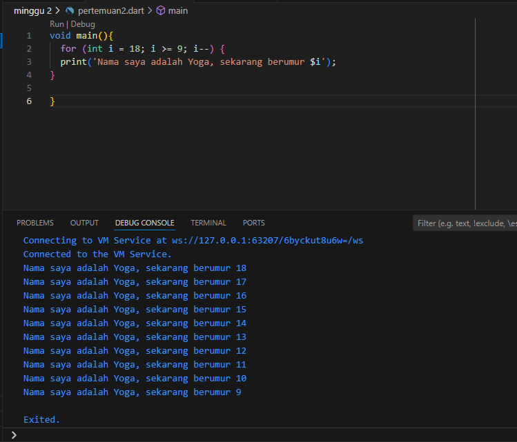

Nama: Agusty Labdanayoga
kelas: TI-3F
Absen :01

# SOAL 1
Modifikasilah kode pada baris 3 di VS Code atau Editor Code favorit Anda berikut ini agar mendapatkan keluaran (output) sesuai yang diminta!

Jawab:

# SOAL 2
Mengapa sangat penting untuk memahami bahasa pemrograman Dart sebelum kita menggunakan framework Flutter ? Jelaskan!

Jawab:Flutter menggunakan Dart sebagai bahasa pemrogramannya. Semua komponen, widget, dan logika aplikasi Flutter ditulis dalam Dart. Jadi, pemahaman yang kuat tentang Dart adalah dasar untuk mengembangkan aplikasi menggunakan Flutter.

# SOAL 3
Rangkumlah materi dari codelab ini menjadi poin-poin penting yang dapat Anda gunakan untuk membantu proses pengembangan aplikasi mobile menggunakan framework Flutter.

Jawab:
Dart adalah bahasa pemrograman yang dikembangkan oleh Google yang digunakan secara luas dalam pengembangan aplikasi, terutama untuk Flutter. Bahasa ini didesain untuk produktivitas pengembang dengan fokus pada kinerja tinggi di aplikasi mobile, web, dan server-side.

Dart telah melalui beberapa fase evolusi sejak pertama kali dirilis pada 2011. Awalnya dikembangkan sebagai alternatif JavaScript, Dart kini menjadi bahasa utama dalam pengembangan aplikasi menggunakan Flutter.

Dart menggunakan dua jenis kompilasi utama: Just-In-Time (JIT) untuk pengembangan cepat dan Ahead-Of-Time (AOT) untuk performa produksi yang optimal. Dengan JIT, pengembang bisa memanfaatkan hot-reload untuk pembaruan cepat. Dengan AOT, Dart menghasilkan kode native yang cepat dan efisien untuk platform mobile dan web.
Dart memiliki bahasa pemrograman berorientasi objek dengan sintaks yang familiar bagi pengembang yang terbiasa dengan bahasa seperti JavaScript, Java, atau C#. Dart mendukung konsep-konsep OOP seperti inheritance, classes, mixins, dan interfaces.
