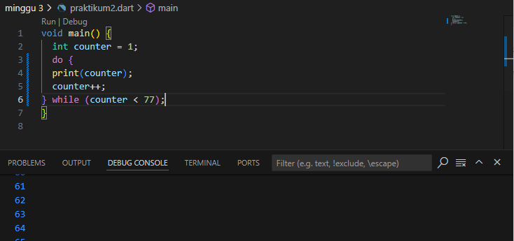

# Praktikum 1: Menerapkan Control Flows ("if/else")

Selesaikan langkah-langkah praktikum berikut ini menggunakan DartPad di browser Anda.

**Langkah 1:**

Ketik atau salin kode program berikut ke dalam fungsi main().

**Langkah 2:**

Silakan coba eksekusi (Run) kode pada langkah 1 tersebut. Apa yang terjadi? Jelaskan!

**Jawab:** yang terjadi hasil kode yang keluar akan "Test2 Test2 again",karena  pada variabel 'String test=test2' jadi saat kondisi if else test == test2 dipanggil maka akan bernilai true jika sama dana akan di eksekusi.

**Langkah 3:**

Tambahkan kode program berikut, lalu coba eksekusi (Run) kode Anda.

Apa yang terjadi ? Jika terjadi error, silakan perbaiki namun tetap menggunakan if/else.

**Jawab:** yang terjadi error karena pada Dart, variabel dengan tipe String tidak bisa langsung digunakan dalam kondisi if, yang mengharapkan ekspresi boolean (bool). Dalam kode , 'test' adalah sebuah String dengan nilai "true", dan Dart tidak secara otomatis mengonversi String menjadi bool.

perbaikan:

# Praktikum 2: Menerapkan Perulangan "while" dan "do-while"

Selesaikan langkah-langkah praktikum berikut ini menggunakan DartPad di browser Anda.

**Langkah 1:**
Ketik atau salin kode program berikut ke dalam fungsi main().

**Langkah 2:**
Silakan coba eksekusi (Run) kode pada langkah 1 tersebut. Apa yang terjadi? Jelaskan! Lalu perbaiki jika terjadi error.

**Jawab:** Kode tersebut akan menghasilkan error karena variabel counter belum dideklarasikan sebelum digunakan di dalam perulangan while. Dalam Dart, setiap variabel harus dideklarasikan terlebih dahulu sebelum digunakan.

Perbaikan:

**Langkah 3:**
Tambahkan kode program berikut, lalu coba eksekusi (Run) kode Anda.

Apa yang terjadi ? Jika terjadi error, silakan perbaiki namun tetap menggunakan do-while.

**Jawab:** Kode tersebut akan error karena variabel counter belum dideklarasikan atau diinisialisasi sebelum digunakan dalam perulangan do-while. Sama seperti dalam perulangan while, setiap variabel yang digunakan harus dideklarasikan terlebih dahulu.

Perbaikan:

# Praktikum 3: Menerapkan Perulangan "for" dan "break-continue"

Selesaikan langkah-langkah praktikum berikut ini menggunakan DartPad di browser Anda.

**Langkah 1:**
Ketik atau salin kode program berikut ke dalam fungsi main().

**Langkah 2:**
Silakan coba eksekusi (Run) kode pada langkah 1 tersebut. Apa yang terjadi? Jelaskan! Lalu perbaiki jika terjadi error.

**Jawab:** Kode tersebut menghasilkan error karena beberapa masalah dalam perulangan for:

1. Inisialisasi variabel index: Variabel index belum dideklarasikan sebelum digunakan.
2. Inkrementasi: Tidak ada bagian yang mengubah nilai index di dalam perulangan. Dalam perulangan for, biasanya diperlukan inkrementasi (misalnya, index++) untuk mengubah nilai index di setiap iterasi agar loop tidak berjalan terus-menerus.

perbaikan:

**Langkah 3:**
Tambahkan kode program berikut di dalam for-loop, lalu coba eksekusi (Run) kode Anda.

Apa yang terjadi ? Jika terjadi error, silakan perbaiki namun tetap menggunakan for dan break-continue.

**Jawab:** Terdapat beberapa masalah dengan kode yang  berikan:

1. Kekurangan penulisan if else: if(){} yang benar 
2. Logika pada kondisi else if (index > 1 || index < 7): Kondisi ini akan selalu benar karena menggunakan operator OR (||), yang mana salah satu dari kondisi tersebut (index > 1) akan selalu benar untuk hampir semua nilai index, kecuali index == 1.

perbaikan:

# Tugas Praktikum

2. Buatlah sebuah program yang dapat menampilkan bilangan prima dari angka 0 sampai 201 menggunakan Dart. Ketika bilangan prima ditemukan, maka tampilkan nama lengkap dan NIM Anda.

**Jawab:**

