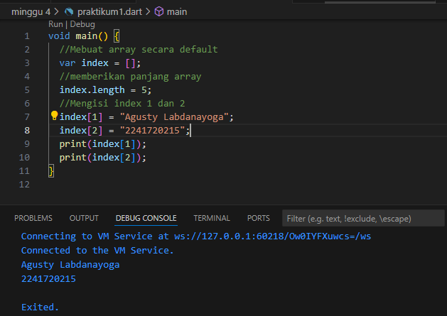
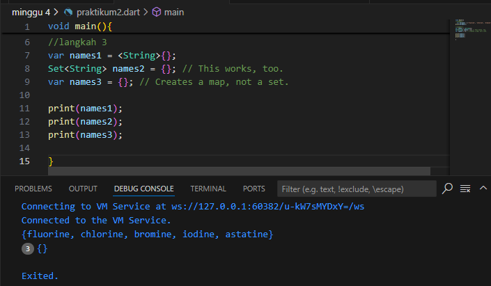

# Praktikum 1: Eksperimen Tipe Data List

**Langkah 1:**

Ketik atau salin kode program berikut ke dalam void main().


**Langkah 2:**

Silakan coba eksekusi (Run) kode pada langkah 1 tersebut. Apa yang terjadi? Jelaskan!

**Jawab:** 
- var list = [1, 2, 3]; 
ini mendeklarasikan sebuah variabel list yang berisi array (atau daftar) dengan elemen [1, 2, 3].

- assert(list.length == 3);
Fungsi assert memeriksa apakah panjang (length) dari list adalah 3. Karena daftar memiliki 3 elemen, maka kondisi ini benar dan program berlanjut tanpa masalah.

- assert(list[1] == 2);
Ini memeriksa apakah elemen pada indeks 1 dari daftar adalah 2. Indeks 1 dari daftar [1, 2, 3] memang bernilai 2, jadi assert ini lulus.

- print(list.length);
print(list[1]);
print(list[1]);
jadi jika bernilai true semua maka akan keluar output 3 2 1

**Langkah 3:**

Ubah kode pada langkah 1 menjadi variabel final yang mempunyai index = 5 dengan default value = null. Isilah nama dan NIM Anda pada elemen index ke-1 dan ke-2. Lalu print dan capture hasilnya.

hasil


Apa yang terjadi ? Jika terjadi error, silakan perbaiki.

**Jawab:** yang terjadi yaitu output dari program diatas mengeluarkan Nama dan Nim yaitu isi dari list index[1] & index[2]


# Praktikum 2: Eksperimen Tipe Data Set

Selesaikan langkah-langkah praktikum berikut ini menggunakan VS Code atau Code Editor favorit Anda.

**Langkah 1:**

Ketik atau salin kode program berikut ke dalam fungsi main().


**Langkah 2:**

Silakan coba eksekusi (Run) kode pada langkah 1 tersebut. Apa yang terjadi? Jelaskan! Lalu perbaiki jika terjadi error.

**Jawab:** yang terjadi isi list dari variabel halogens[] diprint maka akan keluar semua isi dari list tersebut.

**Langkah 3:**

Tambahkan kode program berikut, lalu coba eksekusi (Run) kode Anda.



Apa yang terjadi ? Jika terjadi error, silakan perbaiki namun tetap menggunakan ketiga variabel tersebut. Tambahkan elemen nama dan NIM Anda pada kedua variabel Set tersebut dengan dua fungsi berbeda yaitu .add() dan .addAll(). Untuk variabel Map dihapus, nanti kita coba di praktikum selanjutnya.

**Jawab:** yang tejadi output akan keluar {} 3 kali karena tidak ada data didalamnya.

perbaikan:


# Praktikum 3: Eksperimen Tipe Data Maps

**Langkah 1:**

Ketik atau salin kode program berikut ke dalam fungsi main().


**Langkah 2:**

Silakan coba eksekusi (Run) kode pada langkah 1 tersebut. Apa yang terjadi? Jelaskan! Lalu perbaiki jika terjadi error.

**Jawab:** Yang terjadi isi dari Map gifts dan nobleGases keluar karena diprint.Dalam kode ini, baik gifts maupun nobleGases adalah contoh Map dengan tipe key yang berbeda (string dan integer), serta nilai-nilai yang bervariasi (string dan integer). 

**Langkah 3:**

Tambahkan kode program berikut, lalu coba eksekusi (Run) kode Anda.


Apa yang terjadi ? Jika terjadi error, silakan perbaiki.

Tambahkan elemen nama dan NIM Anda pada tiap variabel di atas (gifts, nobleGases, mhs1, dan mhs2). Dokumentasikan hasilnya dan buat laporannya

**Jawab:** yang terjadi yaitu menambahkan Map didalam Map, diamana var Map mhs1 dan mhs2 ditambahkan dengan menambahkan Map gifts didalam Map mhs1 dan Map nobleGases didalam mhs2

hasil:


# Praktikum 4: Eksperimen Tipe Data List: Spread dan Control-flow Operators

**Langkah 1:**

Ketik atau salin kode program berikut ke dalam fungsi main().


**Langkah 2:**

Silakan coba eksekusi (Run) kode pada langkah 1 tersebut. Apa yang terjadi? Jelaskan! Lalu perbaiki jika terjadi error.

**Jawab:** error,karena variabel list1 tidak ada maka ketika dirun error,maksud dari kode diatas  print(list);(untuk memperlihatkan isi dari list)
print(list2);(didalam list2 ada yang menarik yaitu ...list maksudnya length/panjang dari variabel list )
print(list2.length);(yaitu panjang list dari variabel list2)

perbaikan:


**Langkah 3:**

Tambahkan kode program berikut, lalu coba eksekusi (Run) kode Anda.


Apa yang terjadi ? Jika terjadi error, silakan perbaiki.

Tambahkan variabel list berisi NIM Anda menggunakan Spread Operators. Dokumentasikan hasilnya dan buat laporannya!

**Jawab:** error,  Spread (...?): Operator ini digunakan untuk menangani situasi ketika seluruh list mungkin null. Namun, ini tidak mengatasi elemen null di dalam list. Jika list tersebut berisi null (seperti dalam kasus list1 = [1, 2, null]), maka Dart akan tetap menyebarkan elemen null ke dalam list3

perbaikan:


Tugas:


**Langkah 4:**

Tambahkan kode program berikut, lalu coba eksekusi (Run) kode Anda.


Apa yang terjadi ? Jika terjadi error, silakan perbaiki. Tunjukkan hasilnya jika variabel promoActive ketika true dan false

**Jawab:** error pada kode tersebut mungkin disebabkan oleh variabel promoActive yang belum didefinisikan. Dalam Dart, menggunakan ekspresi bersyarat if di dalam list untuk menyertakan item secara dinamis, tetapi variabel seperti promoActive harus dideklarasikan sebelumnya agar bisa digunakan.

Perbaikan:
true

false
   

**Langkah 5:**

Tambahkan kode program berikut, lalu coba eksekusi (Run) kode Anda.

Apa yang terjadi ? Jika terjadi error, silakan perbaiki. Tunjukkan hasilnya jika variabel login mempunyai kondisi lain.

**Jawab:** Error pada kode tersebut disebabkan oleh sintaks yang salah pada ekspresi bersyarat di dalam list. Ekspresi bersyarat di dalam list (if) hanya dapat menggunakan ekspresi boolean untuk menentukan apakah item harus ditambahkan ke list.

Dalam kode , if (login case 'Manager') tidak valid karena login case 'Manager' bukanlah ekspresi boolean. kita harus menggunakan ekspresi yang menghasilkan nilai true atau false.

Perbaikan:
 

**Langkah 6:**

Tambahkan kode program berikut, lalu coba eksekusi (Run) kode Anda.


Apa yang terjadi ? Jika terjadi error, silakan perbaiki. Jelaskan manfaat Collection For dan dokumentasikan hasilnya.

**Jawab:** 
- ['#0'] : Dimulai dengan list yang berisi elemen pertama '#0'.
- for (var i in listOfInts) : Melakukan iterasi terhadap elemen-elemen dalam listOfInts.
- '#$i' : Untuk setiap elemen dalam listOfInts, elemen tersebut dimasukkan ke dalam string '#' dengan menggabungkan nilai i. $i adalah cara dalam Dart untuk memasukkan nilai variabel ke dalam string.

- Manfaat Collection:Collection for di Dart adalah fitur yang memungkinkan  untuk membuat koleksi (seperti list, set, atau map) dengan lebih efisien dan ringkas menggunakan struktur perulangan for

# Praktikum 5: Eksperimen Tipe Data Records

**Langkah 1:**

Ketik atau salin kode program berikut ke dalam fungsi main().


**Langkah 2:**

Silakan coba eksekusi (Run) kode pada langkah 1 tersebut. Apa yang terjadi? Jelaskan! Lalu perbaiki jika terjadi error.

**Jawab:** yang terjadi keluar ouput dari variabel record.Dalam Dart, tipe data seperti tuple tidak mendukung penulisan label seperti a: 2 atau b: true di dalamnya.jadi untuk membuat tuple sederhana seperti ini :
var record = ('first', 2, true, 'last');


**Langkah 3:**

Tambahkan kode program berikut di luar scope void main(), lalu coba eksekusi (Run) kode Anda.


Apa yang terjadi ? Jika terjadi error, silakan perbaiki. Gunakan fungsi tukar() di dalam main() sehingga tampak jelas proses pertukaran value field di dalam Records.

**Jawab:** yang terjadi sama seperti langkah 1,karena seharusnya fungsi tukar dipanggil dalam main() agar dapat berfungsi.

Gunakan fungsi tukar() di dalam main():


Penjelasan:
Record Awal: Kode yang ada sudah memiliki swappedRecord (), tapi untuk mendemonstrasikan pertukaran nilai, saya hanya menambahkan pemanggilan fungsi tukar() dengan record (2, 5).
Menggunakan tukar(): Bagian var swappedRecord = tukar((2, 5)); digunakan untuk memanggil fungsi tukar() yang akan menukar dua nilai integer.

**Langkah 4:**

Tambahkan kode program berikut di dalam scope void main(), lalu coba eksekusi (Run) kode Anda.


Apa yang terjadi ? Jika terjadi error, silakan perbaiki. Inisialisasi field nama dan NIM Anda pada variabel record mahasiswa di atas. Dokumentasikan hasilnya dan buat laporannya!

**Jawab:** yang terjadi,Error tersebut terjadi karena  mendeklarasikan tipe record (String, int) untuk variabel mahasiswa namun belum memberikan nilai awal (initial value) pada variabel tersebut. Di Dart, semua variabel harus diinisialisasi sebelum digunakan, kecuali jika tipe datanya adalah null-able.

perbaikan:


Inisialisasi field nama dan NIM Anda pada variabel record:


**Langkah 5:**

Tambahkan kode program berikut di dalam scope void main(), lalu coba eksekusi (Run) kode Anda.


Apa yang terjadi ? Jika terjadi error, silakan perbaiki. Gantilah salah satu isi record dengan nama dan NIM Anda, lalu dokumentasikan hasilnya dan buat laporannya!

**Jawab:** Tidak ada masalah dalam kode ini, dan hasilnya akan mencetak nilai yang sesuai dengan urutan. Dart mendukung akses ke field positional menggunakan $index dan named fields menggunakan nama field-nya.

Gantilah salah satu isi record dengan nama dan NIM Anda:


# Tugas Praktikum

1. Silakan selesaikan Praktikum 1 sampai 5, lalu dokumentasikan berupa screenshot hasil pekerjaan Anda beserta penjelasannya!

**Jawab:**done

2. Jelaskan yang dimaksud Functions dalam bahasa Dart!

**Jawab:** Functions dalam bahasa Dart adalah blok kode yang dapat digunakan kembali untuk melakukan suatu tugas tertentu. Fungsi membantu dalam mengorganisir kode, menghindari pengulangan, dan membuat program lebih modular. Di Dart, fungsi dapat menerima parameter dan mengembalikan nilai, meskipun fungsi juga dapat tidak mengembalikan nilai atau tidak memerlukan parameter.

3. Jelaskan jenis-jenis parameter di Functions beserta contoh sintaksnya!

**Jawab:**

1. Positional Parameters
Positional parameters adalah parameter yang posisinya menentukan nilai yang harus diberikan saat fungsi dipanggil. Parameter ini bersifat wajib dan tidak dapat dilewati.

contoh:

```dart

    void printInfo(String name, int age) {

  print('Name: $name, Age: $age');

}

void main() {

  printInfo('Agusty', 21); // Output: Name: Agusty, Age: 21

}
```

2. Named Parameters
Named parameters memberikan lebih banyak fleksibilitas dalam pemanggilan fungsi. Mereka memungkinkan kita untuk menyebutkan nama parameter saat memanggil fungsi, sehingga urutan argumen tidak penting. Named parameters bersifat opsional kecuali ditandai dengan required.

contoh:
```dart
void printInfo({required String name, required int age}) {
  print('Name: $name, Age: $age');
}

void main() {
  printInfo(name: 'Agusty', age: 21); // Output: Name: Agusty, Age: 21
}
```
3. Optional Positional Parameters
Optional positional parameters memungkinkan kita untuk mendefinisikan parameter yang tidak wajib diisi. Jika tidak diberikan, mereka akan memiliki nilai null secara default (jika tipe datanya nullable).

contoh:
```dart
void printInfo(String name, [int? age]) {
  if (age != null) {
    print('Name: $name, Age: $age');
  } else {
    print('Name: $name, Age: unknown');
  }
}

void main() {
  printInfo('Agusty');         // Output: Name: Agusty, Age: unknown
  printInfo('Agusty', 21);     // Output: Name: Agusty, Age: 21
}
```
4. Default Parameters
Default parameters adalah parameter opsional yang memiliki nilai default. Jika nilai tidak disediakan saat memanggil fungsi, parameter ini akan menggunakan nilai default yang telah ditentukan.

contoh:
```dart
void printInfo(String name, [int age = 20]) {
  print('Name: $name, Age: $age');
}

void main() {
  printInfo('Agusty');         // Output: Name: Agusty, Age: 20
  printInfo('Agusty', 21);     // Output: Name: Agusty, Age: 21
}
``` 
5. Combined Example: Positional, Named, and Optional Parameters
Kamu juga bisa menggabungkan berbagai jenis parameter dalam satu fungsi, tetapi ada aturan bahwa positional parameters harus dideklarasikan sebelum optional parameters.

```dart
void printInfo(String name, {int age = 20, String? hobby}) {
  print('Name: $name, Age: $age, Hobby: ${hobby ?? 'unknown'}');
}

void main() {
  printInfo('Agusty');                         // Output: Name: Agusty, Age: 20, Hobby: unknown
  printInfo('Agusty', age: 21);                // Output: Name: Agusty, Age: 21, Hobby: unknown
  printInfo('Agusty', age: 21, hobby: 'Coding'); // Output: Name: Agusty, Age: 21, Hobby: Coding
}
```


4. Jelaskan maksud Functions sebagai first-class objects beserta contoh sintaknya!

**Jawab:**

Dalam Dart, functions dianggap sebagai first-class objects, yang berarti fungsi dapat diperlakukan seperti objek lainnya. Artinya, fungsi dapat:

- Disimpan dalam variabel.
- Diteruskan sebagai argumen ke fungsi lain.
- Dikembalikan sebagai nilai dari fungsi lain.
- Disimpan dalam struktur data seperti daftar (list) atau map.

Ini memungkinkan fleksibilitas tinggi dalam penulisan kode, karena fungsi dapat dimanipulasi dan digunakan seperti data lainnya.

contoh:
```dart
void sapa(String name) {
  print('Hello, $name!');
}

void main() {
  var greet = sapa;  // Menyimpan fungsi sapa ke dalam variabel greet
  greet('Agusty');   // Memanggil fungsi melalui variabel
}
```

5. Apa itu Anonymous Functions? Jelaskan dan berikan contohnya!

**Jawab:**

Anonymous functions, atau dikenal juga sebagai fungsi tanpa nama atau lambda functions, adalah fungsi yang didefinisikan tanpa nama. Fungsi ini biasanya digunakan di tempat-tempat di mana fungsi tersebut tidak perlu digunakan kembali, seperti dalam operasi sekali pakai atau sebagai argumen ke fungsi lain.

Sintaks Anonymous Function di Dart
Anonymous function bisa didefinisikan dengan tanda kurung ( ) diikuti dengan { } yang berisi badan fungsi. Mereka juga dapat menerima parameter seperti fungsi biasa.

Bentuk Umum Anonymous Function:

```dart
(parameter1, parameter2, ...) {
  // Badan fungsi
}
```

6. Jelaskan perbedaan Lexical scope dan Lexical closures! Berikan contohnya!

**Jawab:**

1. Lexical Scope

Lexical scope adalah aturan yang menentukan bagaimana variabel dalam suatu fungsi atau blok kode bisa diakses berdasarkan tempat di mana fungsi atau blok kode tersebut dideklarasikan. Dengan kata lain, lexical scope mengacu pada fakta bahwa variabel hanya dapat diakses di dalam blok di mana mereka dideklarasikan, serta di dalam fungsi yang berada di dalam blok tersebut.

Dalam lexical scope, sebuah fungsi dapat mengakses variabel yang dideklarasikan dalam scope di sekitarnya, yaitu di blok atau fungsi yang mendeklarasikan fungsi tersebut.

Contoh Lexical Scope:

```dart
void main() {
  int x = 10;

  void printX() {
    print(x);  // Fungsi ini dapat mengakses variabel 'x' karena berada dalam scope di luar fungsi ini
  }

  printX();  // Output: 10
}
```

2. Lexical Closures

Lexical closure adalah konsep di mana sebuah fungsi dapat "menutup" (atau "membawa") variabel dari lexical scope di sekitarnya bahkan setelah konteks di mana variabel tersebut dideklarasikan sudah selesai dieksekusi. Closure "mengikat" variabel dari scope di mana fungsi itu dideklarasikan, dan variabel tersebut akan tetap tersedia ketika fungsi dijalankan nanti, bahkan setelah lingkup eksternal tidak lagi ada.

Dengan kata lain, closure memungkinkan fungsi untuk mengingat dan menggunakan variabel dari lingkup di luar fungsi, meskipun lingkup tersebut sudah berakhir atau tidak aktif lagi.

Contoh Lexical Closure:
```dart
Function createAdder(int x) {
  return (int y) => x + y;  // Fungsi ini "menutup" variabel 'x' dari scope di luar fungsi ini
}

void main() {
  var addTen = createAdder(10);
  print(addTen(5));  // Output: 15
}
```


7. Jelaskan dengan contoh cara membuat return multiple value di Functions!

**Jawab:**

1. Menggunakan Tuple (Record)
Dart mendukung penggunaan record untuk mengembalikan beberapa nilai. Anda bisa mengembalikan nilai dalam bentuk record dengan mendeklarasikan nilai yang ingin dikembalikan.

Contoh Menggunakan Record:
```dart
// Mendefinisikan fungsi yang mengembalikan record
(String, int) getUserInfo() {
  return ('Agusty Ladanayoga', 123456);
}

void main() {
  var userInfo = getUserInfo(); // Memanggil fungsi

  // Mengakses nilai dari record
  print('Nama: ${userInfo.$1}'); // Output: Nama: Agusty Ladanayoga
  print('NIM: ${userInfo.$2}');   // Output: NIM: 123456
}
```
2. Menggunakan List
Anda juga dapat mengembalikan nilai dalam bentuk list. Meskipun list biasanya digunakan untuk koleksi, ini juga cara yang baik untuk mengembalikan beberapa nilai.

Contoh Menggunakan List:
```dart
List<dynamic> calculateValues() {
  int sum = 5 + 10;
  double average = sum / 2;

  return [sum, average]; // Mengembalikan list dengan dua nilai
}

void main() {
  var results = calculateValues(); // Memanggil fungsi

  print('Jumlah: ${results[0]}');    // Output: Jumlah: 15
  print('Rata-rata: ${results[1]}');  // Output: Rata-rata: 7.5
}
```
3. Menggunakan Object
Cara yang paling jelas dan sering digunakan adalah dengan mengembalikan sebuah objek. Anda bisa membuat kelas untuk mengemas beberapa nilai yang ingin dikembalikan.

Contoh Menggunakan Object:
```dart
class User {
  String name;
  int nim;

  User(this.name, this.nim); // Constructor untuk inisialisasi
}

User getUser() {
  return User('Agusty Ladanayoga', 123456); // Mengembalikan objek User
}

void main() {
  var user = getUser(); // Memanggil fungsi

  print('Nama: ${user.name}'); // Output: Nama: Agusty Ladanayoga
  print('NIM: ${user.nim}');    // Output: NIM: 123456
}
```
4. Menggunakan Map
Anda juga dapat menggunakan Map untuk mengembalikan beberapa nilai dengan kunci yang jelas.

Contoh Menggunakan Map:
```dart
Map<String, dynamic> getStudentData() {
  return {
    'name': 'Agusty Ladanayoga',
    'nim': 123456,
    'status': 'active'
  };
}

void main() {
  var studentData = getStudentData(); // Memanggil fungsi

  print('Nama: ${studentData['name']}'); // Output: Nama: Agusty Ladanayoga
  print('NIM: ${studentData['nim']}');    // Output: NIM: 123456
  print('Status: ${studentData['status']}'); // Output: Status: active
}
``` 