# PRAKTIKUM 1

Langkah 1: 

Buat Project Baru
Buatlah sebuah project flutter baru dengan nama kamera_flutter, lalu sesuaikan style laporan praktikum yang Anda buat.

Langkah 2: 

Tambah dependensi yang diperlukan
Anda memerlukan tiga dependensi pada project flutter untuk menyelesaikan praktikum ini.

camera → menyediakan seperangkat alat untuk bekerja dengan kamera pada device.

path_provider → menyediakan lokasi atau path untuk menyimpan hasil foto.

path → membuat path untuk mendukung berbagai platform.

Untuk menambahkan dependensi plugin, jalankan perintah flutter pub add seperti berikut di terminal:

Langkah 3: 

Ambil Sensor Kamera dari device
Selanjutnya, kita perlu mengecek jumlah kamera yang tersedia pada perangkat menggunakan plugin camera seperti pada kode berikut ini. Kode ini letakkan dalam void main().

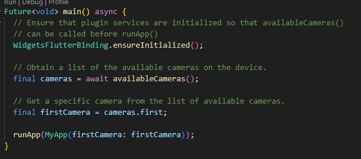

Langkah 4: 

Buat dan inisialisasi CameraController
Setelah Anda dapat mengakses kamera, gunakan langkah-langkah berikut untuk membuat dan menginisialisasi CameraController. Pada langkah berikut ini, Anda akan membuat koneksi ke kamera perangkat yang memungkinkan Anda untuk mengontrol kamera dan menampilkan pratinjau umpan kamera.

Buat StatefulWidget dengan kelas State pendamping.
Tambahkan variabel ke kelas State untuk menyimpan CameraController.
Tambahkan variabel ke kelas State untuk menyimpan Future yang dikembalikan dari CameraController.initialize().
Buat dan inisialisasi controller dalam metode initState().
Hapus controller dalam metode dispose().

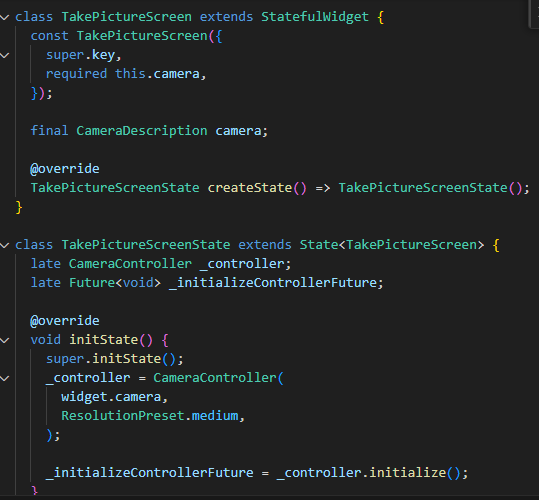

Langkah 5: 

Gunakan CameraPreview untuk menampilkan preview foto
Gunakan widget CameraPreview dari package camera untuk menampilkan preview foto. Anda perlu tipe objek void berupa FutureBuilder untuk menangani proses async.

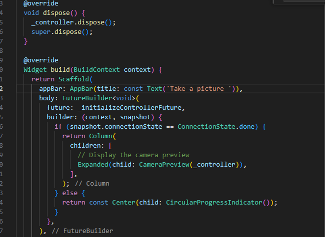

Langkah 6: 

Ambil foto dengan CameraController
Anda dapat menggunakan CameraController untuk mengambil gambar menggunakan metode takePicture(), yang mengembalikan objek XFile, merupakan sebuah objek abstraksi File lintas platform yang disederhanakan. Pada Android dan iOS, gambar baru disimpan dalam direktori cache masing-masing, dan path ke lokasi tersebut dikembalikan dalam XFile.

Pada codelab ini, buatlah sebuah FloatingActionButton yang digunakan untuk mengambil gambar menggunakan CameraController saat pengguna mengetuk tombol.

Pengambilan gambar memerlukan 2 langkah:

Pastikan kamera telah diinisialisasi.
Gunakan controller untuk mengambil gambar dan pastikan ia mengembalikan objek Future.
Praktik baik untuk membungkus operasi kode ini dalam blok try / catch guna menangani berbagai kesalahan yang mungkin terjadi.

Kode berikut letakkan dalam Widget build setelah field body.

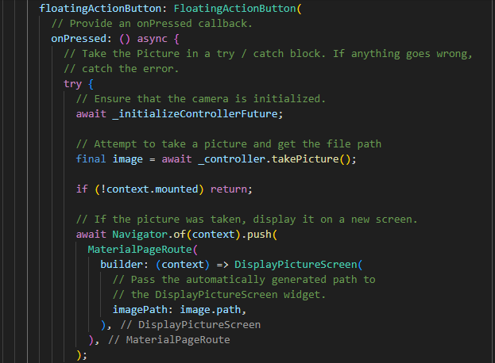

Langkah 7: 

Buat widget baru DisplayPictureScreen
Buatlah file baru pada folder widget yang berisi kode berikut.

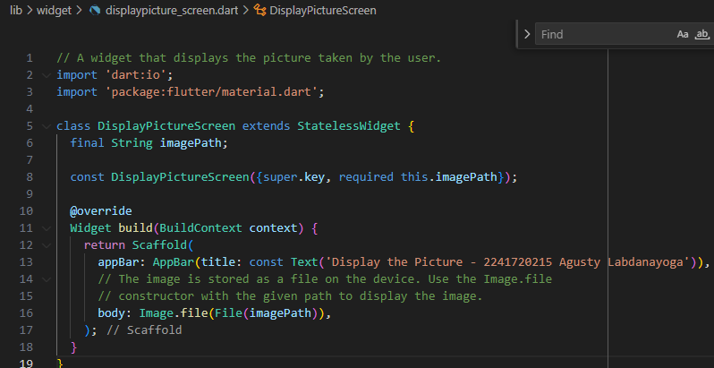

Langkah 8: 

Edit main.dart
Edit pada file ini bagian runApp seperti kode berikut.

Langkah 9: 

Menampilkan hasil foto
Tambahkan kode seperti berikut pada bagian try / catch agar dapat menampilkan hasil foto pada DisplayPictureScreen.

Silakan deploy pada device atau smartphone Anda dan perhatikan hasilnya! 

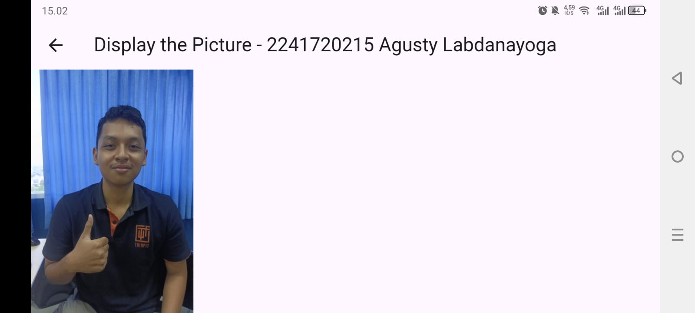

kode lengkap: https://github.com/doggest25/kamera_flutter

# PRAKTIKUM 2

Langkah 1: 

Buat project baru
Buatlah project flutter baru di pertemuan 09 dengan nama photo_filter_carousel

Langkah 2: 

Buat widget Selector ring dan dark gradient
Buatlah folder widget dan file baru yang berisi kode berikut.

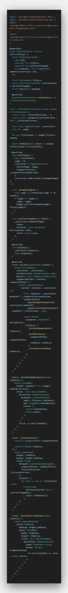

Langkah 3: 

Buat widget photo filter carousel
Buat file baru di folder widget dengan kode seperti berikut.

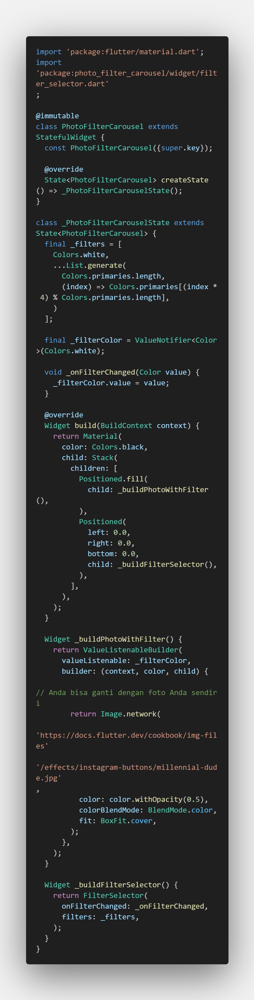

Langkah 4: 

Membuat filter warna - bagian 1
Buat file baru di folder widget seperti kode berikut.

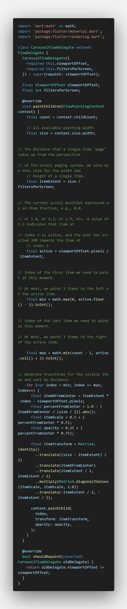

Langkah 5: 

Membuat filter warna
Buat file baru di folder widget seperti kode berikut ini.

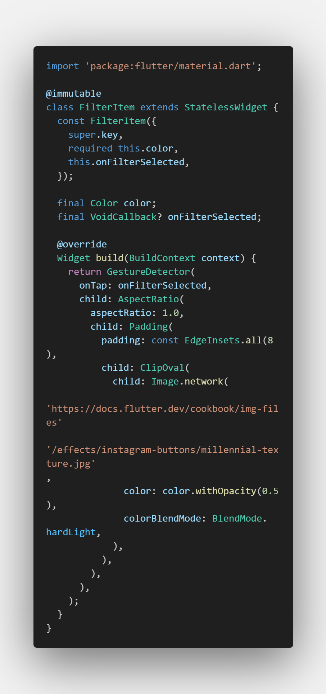

Langkah 6: 

Implementasi filter carousel
Terakhir, kita impor widget PhotoFilterCarousel ke 
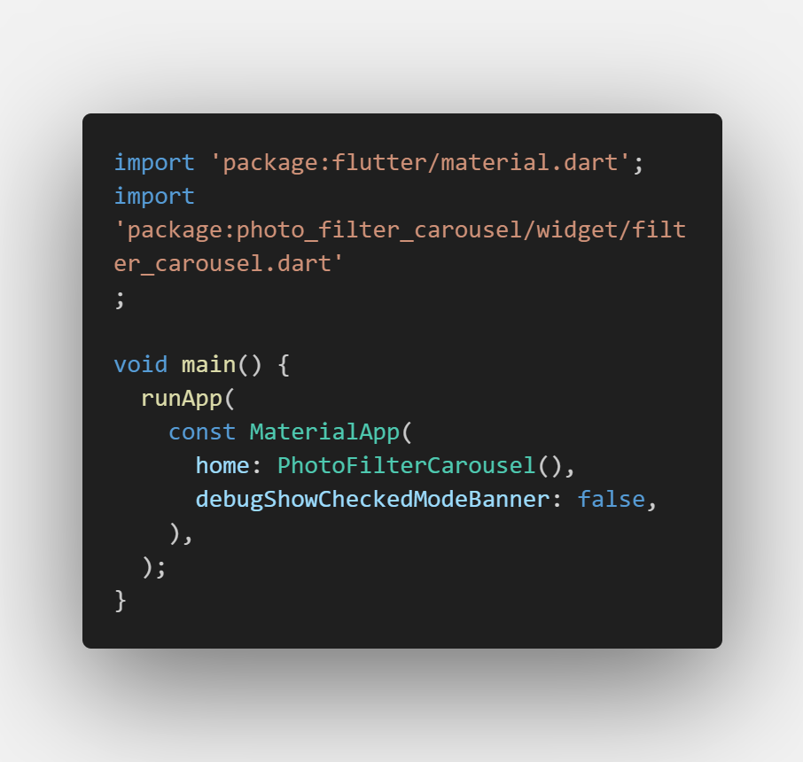
main seperti kode berikut ini.

kode lengkap: https://github.com/doggest25/photo_filter_carousel

# Tugas Praktikum

1. Selesaikan Praktikum 1 dan 2, lalu dokumentasikan dan push ke repository Anda berupa screenshot setiap hasil pekerjaan beserta penjelasannya di file README.md! Jika terdapat error atau kode yang tidak dapat berjalan, silakan Anda perbaiki sesuai tujuan aplikasi dibuat!

Jawab:done

2. Gabungkan hasil praktikum 1 dengan hasil praktikum 2 sehingga setelah melakukan pengambilan foto, dapat dibuat filter carouselnya!

Jawab:

kode lengkap: https://github.com/doggest25/kamera_filter_flutter

3. Jelaskan maksud void async pada praktikum 1?

Jawab:

void:

void digunakan sebagai tipe pengembalian (return type) dari sebuah fungsi. Dalam hal ini, void menandakan bahwa fungsi tersebut tidak mengembalikan nilai apapun.
Misalnya, jika sebuah fungsi bertipe void, maka kamu tidak dapat menulis return <value> di dalamnya karena fungsi tersebut tidak mengharapkan nilai balik.
async:

async menunjukkan bahwa fungsi tersebut akan menjalankan operasi asynchronous, yaitu operasi yang mungkin memerlukan waktu untuk selesai (misalnya mengambil data dari internet, membaca file, atau melakukan proses yang membutuhkan waktu).
Dengan menambahkan async, fungsi ini akan mengembalikan Future, meskipun tipe pengembaliannya ditulis void.
Fungsi async biasanya memuat operasi asynchronous, seperti await <Future>, yang memungkinkan eksekusi kode berjalan tidak secara berurutan tetapi dapat menunggu hingga operasi tertentu selesai sebelum melanjutkan.

4. Jelaskan fungsi dari anotasi @immutable dan @override ?

Jawab:

@immutable: Digunakan untuk kelas yang tidak boleh memiliki properti yang bisa diubah, biasanya pada widget stateless.
@override: Digunakan untuk menandakan bahwa metode atau properti di suatu kelas sedang mengganti versi yang ada di superclass, membantu dalam validasi penulisan kode.

5. Kumpulkan link commit repository GitHub Anda kepada dosen yang telah disepakati!

Jawab:done
